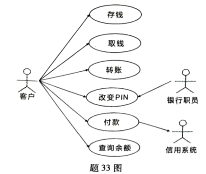

# 单选题

1. 关于软件的定义，以下哪项描述最准确
   1. 软件指用编程语言编写的程序
   2. 软件只涉及用户界面设计
   3. 软件是硬件的一部分
   4. 软件包括程序、数据及其相关文档
2. 符合敏捷开发特点的是
   1. 仅关注技术实现，不重视客户需求
   2. 强调客户在开发过程中的紧密参与和需求反馈
   3. 专注于中间产品的完善，而非最终交付
   4. 避免需求变更，以确保开发进度的稳定性
3. 在结构化软件开发方法中，需求分析阶段的主要任务是
   1. 编写代码
   2. 设计软件的体系结构
   3. 确定软件的功能和性能需求
   4. 进行软件测试
4. 详细设计阶段，常用的表达工具不包括
   1. 程序流程图
   2. N-S图
   3. PAD图
   4. HIPO图
5. 在结构化分析中，分层数据流图的主要优点是
   1. 可以一次性展示系统的全部细节
   2. 能够清晰地表示程序的全部控制结构
   3. 便于实现和便于使用，能够有效控制问题的复杂性
   4. 可以直接用于代码设计
6. 移动应用测试中，性能测试的主要目的是
   1. 发现应用的安全漏洞
   2. 测试在集成系统环境中软件运行时的性能
   3. 确保应用的用户界面美观
   4. 确保应用的导航功能正常
7. 软件测试的主要目的是
   1. 证明程序无错
   2. 发现程序中的错误
   3. 修复程序中的错误
   4. 简化程序的功能
8. 软件维护的分类中，修改或再开发软件，以扩充软件功能，增强软件性能，改进加工效率，提高软件的可维护性，这种情况下进行的维护活动是
   1. 改正性维护
   2. 适应性维护
   3. 完善性维护
   4. 预防性维护
9. 在时序图中，对象之间传递的消息类型不包括
   1. 复杂消息
   2. 同步消息
   3. 异步消息
   4. 返回消息
10. 最典型的MVC模式应用是JSP+Servlet+JavaBean+DAO模式，其中为表现层的是
    1. JSP
    2. Servlet
    3. JavaBean
    4. DAO

# 填空题

1. 软件工程的基本思想是按工程化的原则和方法组织软件开发。
2. 需求分析的任务是弄清用户对软件系统的确切要求，并用需求规格说明书的形式表达出来。
3. 面向对象开发模式的基本成分是对象。
4. 多态性是指子类对象可以像父类对象那样使用同样的消息，但不同层次中的类按自己的需求来实现方法。
5. UML中的组件图显示模型的物理视图。
6. 一个大而复杂的软件系统，也可以根据其功能划分成许多较小的单元或较小的程序，这些较小的单元称作模块。
7. 需求规格说明书的主要内容包括数据描述、功能描述、性能描述和质量保证。
8. 如果一个模块访问另一个模块时，彼此之间是通过数据参数来交换输入输出信息的，则称这种耦合为数据耦合。
9. 移动应用开发中，用户体验测试包括手势测试、虚拟键盘输入、语音输入和识别以及警报和异常条件。
10. 单元测试中，驱动模块的作用是接收测试数据并将其传送给被测模块。

# 名词解释

1. **瀑布模型**

   是一种线性软件开发模型，将软件开发过程划分为

   **需求定义**：弄清用户需求，输出《用户规格说明书》

   **系统和软件设计**：建立总体结构，画出软件体系结构图

   **实现与单元测试**

   **集成于系统测试**：所有模块一起测试，输出测试报告、测试用例、测试结果

   **运行与维护**：软件投入使用，根据用户要求进行维护

2. **数据流图**

   表达目标系统逻辑模型的工具，包含加工、数据流向、数据的源点与终点，数据文件或其它数据存储

3. **继承**

   子类从父类派生，自动拥有父类全部数据和服务的面向对象特性

4. **巧合内聚**

   也称偶然内聚，模块内各部分没有联系或联系很松散，内聚程度最低

5. **黑盒测试**

   将程序视为黑盒，不关注内部结构，基于外部功能设计测试用例，验证功能是否正确又称功能测试

# 简答题

1. **简述软件危机所描述的软件开发遇到的主要问题**

   1. 软件开发无计划性
   2. 软件需求不充分
   3. 开发过程无规范
   4. 成本与进度难控制
   5. 产品质量无评测标准与方法
   6. 交付后的软件难以维护

2. **简述封装及其在面向对象方法中的作用**

   封装是面向对象方法的一个重要原则，它将对象的属性和服务结合成一个独立的系统单元，是一种信息隐藏技术。封装的作用是将对象的外部特征与内部实现细节分开，使得对象的外部特征对其他对象是可访问的，而内部细节对其他对象是隐蔽的。

3. **简述UML的主要作用**

   是通用的可视化建模语言，用来描述、可视化处理、构造和建立软件系统文档；覆盖系统需求分析、设计、浏览、配置、维护信息控制全流程

4. **简述软件测试基本步骤**

   单元测试、组装测试、确认测试、系统测试

5. **简述白盒测试的优点**

   可以在开发早期发现许多问题，基于程序内部逻辑结构，在代码级设计测试用例，检查语句、路径、条件等，验证是否符合需求与规范。可以帮助开发人员优化代码，提高软件性能和可维护性

# 应用题

1. **请画出下列伪代码对应的程序流程图和N-S图**

   

2. **ATM系统的需求说明如下：客户可以取钱、存钱、付款、查阅余额和改变PIN；银行职员也可以改变PIN；客户付款到信用系统。请根据ATM系统的用例图（题33图）完成下列任务：**

   

   1. **给出该ATM系统的角色和用例**

      **角色**：客户、银行职员、信用系统

      **用例**：取钱、存钱、转账、改变PIN、付款

   2. **信用系统是否为角色并说明原因**

      信用系统是角色，因为它是外部系统

