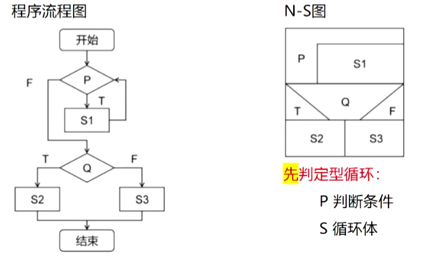

# 简答题

1. **统一过程模型5个阶段**：

   1. **起始阶段**：开展客户沟通与项目策划活动
   2. **细化阶段**：沟通建模，扩展起始阶段用例，创建用例、分析、设计、实现、部署 5 大架构基线，修订项目计划
   3. **构建阶段**：编码实现软件增量功能，完成单元、集成测试，基于用例设计验收测试
   4. **转换阶段**：组织用户 Beta 测试，收集缺陷反馈与变更建议，输出可用的正式发布版本
   5. **生产阶段**：监控软件持续运行，提供环境支持，处理缺陷报告与变更请求

2. **螺旋模型进行软件开发的过程**：

   1. 螺旋模型划分为若干**框架活动**，每个活动对应螺旋的一个片段。
   2. 开发从圆心启动，**顺时针**完成一圈螺旋对应一次演进活动，全程**考虑风险**，每次演进标记里程碑。
   3. 第一圈产出**产品规格说明**，后续迭代开发原型并逐步完善，形成不同软件版本。
   4. 每圈均需经过**策划区域**，据此调整项目计划、预算、进度，以及软件开发的迭代次数。

   **螺旋分段框架活，顺时针演进风险测，首圈出规格，迭代完善多版本，每圈策划调计划，里程碑记全程过**

3. **原型开发存在的问题**：

   1. 相关利益者仅关注软件工作版本，可能忽视原型体系结构的演化，开发者可能无法兼顾整体质量与长期可维护性。    
   2. 软件工程师为快速实现原型常采用折中方案，若不够小心，这些不够完善的选择可能纳入最终系统。

   **利益相关轻架构，开发难顾质与维；原型折中求快速，不慎纳入终系统**

4. **原型模型软件开发流程**

   1. **起始沟通**：开发人员与利益相关者沟通，明确软件整体目标、已知需求，勾勒待细化内容。
   2. **快速策划与设计**：规划原型迭代周期，聚焦用户可见层面（人机接口、输出格式）开展快速建模。
   3. **原型部署与评估**：生成原型并交付，由利益相关者评估试用。
   4. **迭代优化需求**：基于反馈提炼精准需求，迭代调整原型，逐步明确用户真实需求。

   **原型始于沟通会，目标需求先定位；快策快设重界面，部署评估找反馈；迭代优化磨需求，逐步清晰不跑偏**

5. **瀑布模型缺点**：

   1. 项目执行难遵循**顺序化**流程，灵活性差
   2. 客户难以清晰、完整描述全部**需求**
   3. 客户需长期**等待**，仅在项目尾声才能获得可执行程序
   4. 重大错误在评审可运行程序前难以及时发现

   **核心弊端总结**：要求用户在试用软件前就完全、精确地明确所有需求，无法适配需求快速变更场景。

   **瀑布缺点很明显，顺序难遵需求偏；客户久等无程序，重大错误晚发现；需求变更不适应，早期定需太局限**

6. **瀑布模型将软件过程划分**：

   1. **需求定义**：弄清用户需求，输出《用户规格说明书》
   2. **系统和软件设计**：建立总体结构，画出软件体系结构图
   3. **实现与单元测试**
   4. **集成与系统测试**：所有模块一起测试，输出测试报告、测试用例、测试结果
   5. **运行与维护**：软件投入使用，根据用户要求进行维护

7. **软件设计的任务**：

   从软件设计的**技术内容**角度，可将软件设计的任务分为数据设计、体系结构设计、实现过程设计

8. **软件设计分为哪几个步骤**：

   从**工作步骤与管理**角度，软件设计分为两个阶段：

   1. **概要设计**：将软件需求转化为**数据结构**和**软件体系结构**

   2. **详细设计**：细化软件体系结构，输出各组成部分的**详细数据结构**与**算法**

      软硬设计分两段，概要转需定架构，详细细化出算法

9. **软件过程包含哪 4 种基本活动**

   1. **软件需求分析**：调研明确功能、行为、性能、接口等需求，用规范语言描述并形成需求分析文档。
   2. **软件设计和实现**：设计并落地实现需求分析阶段定义的功能与性能要求。
   3. **软件测试**：验证软件功能正确性及性能是否符合需求分析文档规范。
   4. **软件演进**：迭代改进、完善功能，适配用户动态变化的需求。

   **需求分析定需求、成文档；设计实现落功能、保性能；测试验证符规范；演进迭代适新求**

10. **软件危机用于描述软件开发中遇到的哪些问题**

    1. 软件开发**无计划性**
    2. 软件**需求不充分**
    3. 开发过程**无规范**
    4. 成本与进度**难控制**
    5. 产品质量**无评测标准与方法**
    6. 交付后的软件**难以维护**

    **软件危机六宗罪，计划需求全缺位；过程无规难管控，质量无标维护累**

11. **软件工程的研究领域包括哪些方面**

    1. 软件开发过程的**步骤规划**
    2. 软件需求的**获取与规范描述**
    3. 软件设计的**方案制定与表达**
    4. 高质量、易维护的**程序实现方法**
    5. 保障功能正确、减少隐藏错误的**软件测试策略**
    6. 确保项目顺利推进的**软件项目管理方法**

    **过程步骤需规划，需求获取要规范；设计方案明表达，编码实现高质管；测试纠错保正确，项目管理促进展**

12. **软件有哪些特点/软件与硬件相比具有的特点**

    1. 生产方式不同
    2. 磨损形式不同
    3. 开发个性化强，需定制
    4. 抽象性更强
    5. 开发成本难控制
    6. 功能关联社会管理因素

    **生产磨损各不同，个性抽象成本重，还涉社会管理中**

13. **如何改进软件模块结构**

    1. 完善模块功能，反馈执行状态与失败原因
    2. 消除重复功能，优化软件结构
    3. 设计功能可预测模块，避免过度限制
    4. 保证模块作用范围在控制范围之内
    5. 控制扇出、增大扇入，优化模块调用关系
    6. 模块大小设计适中

    **功能完善消重复，可预测无过度限；作用受控调扇入，大小适中结构优**

14. **什么是模块的独立性**

    软件系统中每个模块仅实现特定子功能，且与其他模块的接口简单

     **模块的基本属性有哪些**

    1. **功能**：模块要实现的具体任务
    2. **逻辑**：模块内部的实现方式
    3. **状态**：模块运行的环境与条件

    **模块属性三要素，功能做啥，逻辑咋做，状态凭啥**

15. **软件详细设计阶段需要完成哪些工作**

    1. 确定各组成部分的**算法**与**内部数据组织**
    2. 选择表达形式描述算法
    3. 开展详细设计评审

    **算法数据定清楚，算法描述选形式，设计评审不可无**

16. **概要设计的数据结构设计阶段需要完成哪些工作**

    1. 确定输入 / 输出文件的详细数据结构
    2. 结合算法，明确所需逻辑数据结构及操作
    3. 确定逻辑数据操作的程序模块，界定数据设计决策影响范围
    4. 按需确定系统接口控制表等数据的结构与使用规则
    5. 完成数据的保护性设计

    **文件结构先确定，逻辑数据配算法；模块范围要界定，接口数据定规则；最后做好保护性**

17. **画分层数据流图有哪些原则**

    1. 父图子图**输入输出平衡**
    2. 区分**局部文件与外部项**
    3. 控制**分解速度**    
    4. 遵守**加工编号规则**

    **父子平衡，局部分清；分解控速，编号遵行**

18. **画分层数据流图的思想是什么**

    以**整个系统为单一加工**构建基本模型，逐层分解系统；每分解一次，加工数量增加、功能更具体，直至所有加工足够简单无需再分

19. **结构化分析方法的定义是什么**

    使用数据流图、数据结构图、结构化英语、判定表、判定树等工具，构建软件需求规格说明书（结构化说明书）的分析方法。

20. **判定表和判定树的用途是什么？**

    1. **判定表**：以表格表达含复杂多分支判断的加工逻辑
    2. **判定树**：判定表的图形化形式，适用场景相同；可根据用户习惯二选一

21. **数据字典使用哪些符号**

    1. `=`：等于、定义为
    2. `+`：加
    3. `[]`：选择符
    4. `{}`：重复符（前后数字表重复上下限）
    5. `()`：可选符
    6. `*……*`：注释符

22. **数据字典的作用是什么？**

    为数据流图中每个数据定义条目，保障数据在系统内的一致性。

23. **数据流图由哪些符号组成？**

    1. ○：加工
    2. →：数据流向
    3. □：数据的源点与终点
    4. = / —：数据文件（数据存储）

24. **需求规格说明书主要包括哪些内容？**

    1. 引言
    2. 数据描述（含数据流图、数据字典）
    3. 功能描述
    4. 性能描述
    5. 质量保证

25. **软件需求分析的步骤有哪些？**

    1. 调研现实环境，建立当前系统**具体模型**
    2. 剔除非本质因素，抽象当前系统**逻辑模型**
    3. 对比差异，构建目标系统**逻辑模型**
    4. 完善目标系统，编写**需求说明**
    5. 复审需求文档，确认符合用户需求

26. **软件需求分析应遵循哪些原则？**

    1. 需求说明具备**准确性、一致性**
    2. 需求说明清晰准确，**无歧义**

27. **软件需求分析的任务是什么？**

    **明确用户对软件系统的确切要求，并编写成需求规格说明书**。

28. **面向对象软件设计需要完成哪些工作？**

    1. 数据 / 类设计
    2. 体系结构设计
    3. 接口设计
    4. 构件设计

29. **面向对象设计的任务是什么？**

    将需求分析的**分析模型**转换为**设计模型**，细化需求并修正、补充分析模型。

30. **简述识别对象状态空间的步骤**

    1. 识别对象在问题域的**生命周期**
    2. 确定生命周期**阶段划分策略**
    3. 按阶段描述生命周期，得到**候选状态**
    4. 识别候选状态下的动作，**调整状态空间**
    5. 分析各状态的**数据属性确定因素**
    6. 检查状态的**确定性与互斥性**

    **识别周期定策略，描述得到候选态；动作调整析属性，确定互斥最后验**

31. **时序图中的对象、消息、生命线、活动棒分别是什么？ **              

    1. **对象**：交互参与部分，格式为 `对象名称:类名称`
    2. **消息**：对象间的通信载体，对应类的操作
    3. **生命线**：表示对象存在周期的虚线，对象仅在生命线上交换消息
    4. **活动棒**：生命线上的狭长矩形，内部消息时序明确，操作要么全执行、要么全不执行，共同完成一个完整任务

    **对象名类定，消息是操作；生命线虚线，活动棒整活**

32. **时序图的主要任务是什么？**

    1. 表达程序运行时的**对象协作模型**
    2. 验证**领域模型类图**的正确性
    3. 为程序员提供**编码蓝图**

    **表达协作，验证类图，提供编码蓝图**

33. **类与对象的筛选需要考虑哪些方面？**

    1. **冗余**：同类信息保留描述力最强的名称
    2. **无关**：仅纳入与问题密切相关的类与对象
    3. **笼统**：剔除模糊、笼统的类
    4. **属性**：区分候选对象与对象属性；独立性强的性质可定为类
    5. **操作**：谨慎判断，确定是类还是类的操作
    6. **实现**：分析阶段排除与实现相关的候选类与对象

    **冗余无关笼统弃，属性操作细辨析，实现相关暂屏蔽**

34. **类之间的关联关系、泛化关系、整体 - 部分关系、依赖关系、多重性分别是什么？**

    1. **关联关系**：两个类对象间的**结构性关系**
    2. **泛化关系**：类之间的**一般与特殊**关系
    3. **整体 - 部分关系**：关联的特例，分两种
       1. 聚合：部分实例可独立存在、参与多个整体构成
       2. 组合：部分实例完全属于整体，与整体共存亡
    4. **依赖关系**：类之间的**使用关系**，无结构关联，属于弱相关
    5. **多重性**：用于关联 / 整体 - 部分关系，代表对象间数量的**最少与最多限制**

    **关联结构泛化特，整体部分分聚合；依赖弱用无结构，多重性定数量限**

35. **类中的属性和操作分别是什么？**

    1. **属性**：描述类的对象所具有的**特征**
    2. **操作**：对数据的具体处理方法，可实现属性值的存取 / 改变，或执行特定动作

    **属性描特征，操作处理数据定行动**

36. **类由哪些部分组成**

    类名、属性及操作组成

37. **对象模型中的实体类、边界类、控制类分别是什么？**

    1. **实体类**：问题域核心类，由客观实体抽象而来，用于**长期存储系统信息**并提供相关处理行为
    2. **边界类**：系统与外界交互的媒介，外界消息需通过边界类实例才能传入系统
    3. **控制类**：负责**协调边界类与实体类之间的交互**

    **实体存信息，边界连内外，控制协交互**

38. **对用例的描述包括哪些方面？**

    1. **用例简述**：用 1-2 句话说明用例的核心目的
    2. **正常流**：描述执行者与系统的标准交互过程，默认流程可完整实现
    3. **替代流**：说明正常流之外的备选路径，不与正常流混杂（不写`if-then-else`）
    4. **意外处理**：针对系统错误导致的异常状况，区别于执行者主动选择的替代流

    **简述明目的，正常流标交互，替代流列备选，意外处理排故障**

39. **用例图的规范有哪些？**

    1. **用例**：对应用户的完整功能期望，用**椭圆形**表示
    2. **执行者**：代表特定角色的用户 / 系统，用**棒状小人**表示
    3. **关联关系**：执行者与用例之间用**带箭头的线**连接
    4. **包含关系**：基本用例可包含其他用例行为；执行基本用例时必执行被包含用例，且被包含用例可单独执行

    **用例椭圆表功能，执行者小人来充当，关联箭头连双方，包含必执行且可独闯**

40. **基于用例实现的面向对象的建模步骤有哪些？**

    1. 沟通用户，明确**基本需求**
    2. 确定系统边界，明确功能范围与外部交互，建立**上下文模型**
    3. 梳理业务流程，建立**活动图模型**
    4. 从用户交互视角，确定系统功能，建立**用例模型**
    5. 识别问题域内实体对象与类，定义属性、方法及类层次关系，建立**静态结构模型**
    6. 基于用例，用**时序图**描述对象间交互关系
    7. 识别对象行为与系统工作过程，用**状态图**分析对象状态变化，完善类图
    8. **迭代执行**步骤 1-7，直至模型建立完成

    **需求边界业务流，用例静态时序构；状态完善类图后，迭代建模直到够**

41. **面向对象分析常用的 5 种 UML 图是什么？  **

    活动图、用例图、时序图、类图、状态图

42. **UML 的定义和用途分别是什么**

    1. **定义**：通用的**可视化建模语言**
    2. **用途**：描述、可视化处理、构造和建立软件系统文档；覆盖系统**需求分析、设计、浏览、配置、维护、信息控制**全流程

43. **移动 App 测试应遵循的准则有哪些？**

    1. 定位性能瓶颈前，**先明确网络与设备环境**
    2. 在**不受控的真实条件**下开展测试
    3. 选用**适配的自动化测试工具**
    4. 借助**加载设备平台矩阵法**，确定核心硬件平台测试组合
    5. 对所有可能平台，**至少做一次端到端功能流校验**
    6. 性能、GUI、兼容性测试，**必须使用真实设备**
    7. 性能指标测量，**仅限无线通信和真实用户负载条件**

    **先明环境再实测，选对工具定平台；全平台验功能流，真机测三项性能；负载通信真实态，指标测量才靠谱**

44. **WebApp 构件设计的要点是什么？**

    1. **核心特性**：构件需具备**定义良好的聚合功能**，可处理用户内容、提供计算或数据处理能力
    2. **功能定位**：作为**内容与功能的聚合包**，直接满足最终用户需求
    3. **设计元素**：构件级设计包含**内容设计元素**和**功能设计元素**两大类

    **聚合功能定义好，内容功能包成套；设计元素分两类，内容功能都要到**

45. **美学设计的参考原则有哪些？**

    1. 页面需**适当留白**
    2. **重视内容**，内容为核心导向
    3. 布局元素按**左上到右下**的视觉顺序组织
    4. 页面布局按**导航、内容、功能**的逻辑划分
    5. 避免依赖**滚动条扩展展示空间**
    6. 设计时需**考虑分辨率与浏览器窗口尺寸**

46. **WebApp 界面设计的目标是什么？**

    1. 建立**一致性窗口**，作为用户访问内容与功能的入口

    2. 以交互流程**引导用户**完成操作

    3. 合理**组织导航选项与内容**，提升用户查找效率

47. **WebApp 设计的内容包括哪些方面**

    界面设计、美学设计、内容设计、导航设计、体系结构设计、构件设计

48. **保证 WebApp 质量的必要步骤是什么？**

    大型项目需先借助专家的专业知识与技术，对 WebApp 进行**设计与评估**，之后再依次开展**内容准备、代码编写、测试验证**工作。

49. **云计算的 3 层体系结构是什么？请简要描述每层的功能。**

    1. **软件即服务（SaaS）**：提供第三方服务商的软件构件与应用，用户可直接使用，无需部署维护
    2. **平台即服务（PaaS）**：提供协同开发平台，支持分布式团队完成设计、实施与测试工作
    3. **基础设施即服务（IaaS）**：提供虚拟计算资源，包含存储、算力、网络连接等底层支撑

50. **在移动应用的设计中应该尽量避免哪些问题？**

    功能复杂、前后矛盾、设计过度、加载过慢、废话连篇、非标准的交互、对常见问题的回答和帮助

    **复、乱、过、慢、冗、异、缺**

51. **设计移动应用程序的方法有哪些？**

    1. **场景化设计**：考量位置、设备、用户姿势、负载干扰、使用喜好等环境因素，及场景间转换
    2. **多场景用户观察**：收集代表性用户信息，关注同一用户在不同场合的任务完成方式，注意隐私问题
    3. **低保真纸质原型**：低成本可用性评估，用卡片 / 便条模拟界面，校验部件布局与交互易用性，再迁移至设备

    **场景考量 + 用户多态观察 + 纸质原型验证**

52. **用于移动应用界面设计的 3 种模型是什么？分别描述其作用。**

    1. **平台模型**：明确支撑应用的平台约束条件
    2. **表示模型**：定义用户界面的外观样式
    3. **任务模型**：结构化呈现用户完成目标所需执行的任务

    **平台定约束，表示定外观，任务定流程**

53. **移动应用开发的开发过程包含哪 5 个迭代阶段？**

    1. **需求分析**：明确产品目标、功能与原型范围，考量人、社会、文化、组织因素影响
    2. **设计**：涵盖架构、导航、界面、内容设计，用屏幕 / 纸质原型验证，适配多屏与平台特性
    3. **开发**：编码实现功能与非功能需求，同步开展测试、可用性及可访问性评估
    4. **稳定**：历经可行性、alpha、beta 原型到候选发布版的迭代优化
    5. **部署**：通过应用商店审查上架；企业内部应用完成全流程质检

    **需、设、开、稳、布**

54. **移动App需要解决哪些技术问题？**

    1. 多平台适配
    2. 开发框架 / 语言选型
    3. 应用商店规则适配
    4. 短周期交付
    5. 界面与传感器交互复杂
    6. 环境有效利用
    7. 电源管理
    8. 安全与隐私
    9. 计算存储受限
    10. 外部服务依赖
    11. 测试复杂

    **平框商周界，环电安存服测**

55. **移动应用具有哪些特点？**

    1. 强调用户体验
    2. 需求及环境的复杂性
    3. 技术难度更高

56. **根据功能的不同，测试数据自动生成工具主要分为哪几类？**

    1. 路径测试数据生成工具
    2. 随机测试数据生成工具
    3. 基于数据规格说明的测试数据生成工具

    **路径 + 随机 + 规格说明**

57. **简述程序调试修改错误的原则。**

    1. 错误处大概率**伴随其他错误**
    2. 要改**错误本质**，而非仅改表现
    3. 修正时警惕**引入新错误**
    4. 改错需**回归程序设计阶段**复盘
    5. 直接修改**源代码**，不改动目标代码

    **同错、治本、防新错、回设计、改源码**

58. **简述程序调试确定错误的性质和位置的原则。**

    1. 分析错误征兆信息
    2. 避开调试死胡同
    3. 工具仅作辅助
    4. 不用试探法

    **析、避、辅、拒**

59. **程序调试的方法有哪些？**

    1. 强行排错
    2. 回溯法排错
    3. 归纳法排错
    4. 演绎法排错

60. **简述程序调试的步骤。**

    1. 定位错误位置
    2. 分析错误根源
    3. 修改排除错误
    4. 测试验证效果
    5. 无效则回退重试

    **定、析、改、验、退**

61. **简述静态错误分析的工作内容。**

    1. 变量类型分析
    2. 引用分析
    3. 表达式分析
    4. 接口分析

62. **简述软件测试的种类。**

    1. 设计评审
    2. 代码审查
    3. 功能测试
    4. 结构测试
    5. 回归测试
    6. 可靠性测试
    7. 强度测试
    8. 性能测试
    9. 恢复测试
    10. 启动 / 停止测试
    11. 配置测试
    12. 安全性测试
    13. 可使用性测试
    14. 可支持性测试
    15. 安装测试
    16. 互连测试
    17. 兼容性测试
    18. 容量测试
    19. 文档测试

    **审评、功结回、靠强性、恢启配、安互兼、容文可支安**

63. **自顶向下组装测试的步骤有哪些？**

    1. 主模块作驱动，下属模块用桩，测试主模块
    2. 按深度优先 / 分层策略，实际模块替代桩模块，下属再设桩，组装新子系统
    3. 回归测试，排查组装引入的新错误
    4. 检查是否所有模块组装完成，未完成则重复步骤 2，完成则终止

    **主测、替桩组装、回归、判完终止**

64. **组装测试的组装方式有哪些？**

    1. **一次性组装测试**
    2. **增殖式组装测试**（含自顶向下、自底向上、混合组装 3 种细分方式）

    **一次性 + 增殖式（顶、底、混）**

65. **桩模块的作用是什么？**

    代替被测模块调用的模块，仅做少量数据操作，无需实现被调用模块的全部功能。

    **替调模块，简操无全功**

66. **驱动模块的作用是什么？**

    作为被测模块的调用者，接收测试数据并传给被测模块，最终输出测试结果。

    **传数调用，输出结果**

67. **单元测试包括哪 5 个方面的内容？**

    模块接口、局部数据结构、路径、错误处理、边界 5 个方面对模块进行检查。

68. **边界值分析方法选择测试用例的原则有哪些？**

    1. 输入范围：取边界点及刚超边界的值
    2. 输入个数：取最大、最小个数及临界增减值
    3. 输出条件：复用输入范围原则
    4. 输出条件：复用输入个数原则
    5. 有序集合：选首、尾元素
    6. 内部数据结构：选其边界值
    7. 挖掘其他潜在边界条件

    **输入边、个数界、输出复用、有序首尾、结构边界、挖潜界**

69. **白盒测试原理是什么？**

    基于程序**内部逻辑结构**，在代码级设计测试用例，检查语句、路径、条件等，验证是否符合需求与规范。

    **透逻辑，查代码，验规范**

70. **白盒测试的优点**

    可以在开发早期发现许多问题，基于程序**内部逻辑结构**，在代码级设计测试用例，检查语句、路径、条件等，验证是否符合需求与规范。可以帮助开发人员优化代码，提高软件性能和可维护性

71. **设计黑盒法测试用例的步骤有哪些？**

    1. 建立等价类表
    2. 给每个等价类编号
    3. 设计用例，尽量多覆盖**有效等价类**，直至全覆盖
    4. 设计用例，每次覆盖一个**无效等价类**，直至全覆盖

    **建表、编号、覆有效、覆无效**

72. **黑盒测试原理是什么？**

    将程序视为黑盒，不关注内部结构，基于外部功能设计测试用例，验证功能是否正确（又称功能测试）。

    **盲盒测，验功能**

73. **软件测试的对象包括什么？**

    需求分析说明、概要设计和详细设计的规格说明、源程序。

74. **软件测试工作应遵循哪些原则？**

    1. 尽早 + 持续测试，降低纠错成本
    2. 测试用例需含输入数据 + 预期输出
    3. 程序员避免自测
    4. 用例覆盖合理 / 不合理输入条件
    5. 关注测试的群集现象
    6. 严格执行测试计划，杜绝随意性
    7. 全面检查每一个测试结果
    8. 妥善保存测试相关文档，便于维护

    **尽早测、含预期、避自测、覆全输入、注群集、遵计划、查结果、存文档**

75. **软件测试的步骤有哪些？**

    单元测试、组装测试、确认测试、系统测试

76. **验收检查必须遵循的最低需求和规范的验收标准是什么？**

    1. 需求要以可测试术语编写、排序并定义
    2. 区分必需、任选、将来三类需求
    3. 明确设备、人员、测试工具等配套需求

    **可测需求、分需求类、明配套需**

77. **结构化程序设计技术包括哪些内容？**

    1. 采用备用件方法
    2. 采用结构更新技术
    3. 完善现有程序文档
    4. 结构化方法实现新子系统
    5. 运用结构化小组设计思想与结构文档工具

    **备件、更新、补文档、建子系统、小组化**

78. **衡量软件可维护性的指标有哪些？**

    可理解性、可靠性、可测试性、可修改性、可移植性、效率、可使用性。

79. **重新验证程序的方法有哪些？**

    1. **静态确认**：核查修改是否符合规格、修正是否到位、有无副作用
    2. **计算机确认**：按序测试，准备标准用例，借助工具，邀请用户参与
    3. **维护后验收**：检验文档、测试记录、软件配置、维护工序是否完备

    **静态核、机测验、验收检**

80. **修改程序时应遵循哪些要求？**

    1. 正确高效编写修改代码
    2. 保持原程序风格格式，标注改动指令
    3. 不随意删除程序语句
    4. 不共用已有临时变量 / 工作区
    5. 插入错误检测语句
    6. 做好修改记录，消除副作用

    **准编、保格、不删、自建、插检、记改**

81. **程序修改计划包含哪些内容？**

    1. 规格说明信息：数据、处理、作业控制语言、系统接口的修改
    2. 维护资源：新程序版本、测试数据、所需软件系统
    3. 人员安排：程序员、用户相关人员、技术支持、厂家联系人、数据录入员
    4. 工作资源：纸、笔、计算机媒体（每项需明确必要性、实施起点、是否接受、完成日期）

    **规说、维资、人员、工资（四要素备注）**

82. **分析理解程序可采用哪些方法？**

    1. 分析程序结构图
    2. 数据跟踪
    3. 控制流跟踪
    4. 阅读源程序清单与文档，分析文档合理性
    5. 利用编译 / 汇编程序提供的交叉引用表、符号表等信息
    6. 参与开发工作（如有可能）

    **析结构图、跟数据、跟控制、读文档、用工具、参开发**

83. **分析理解程序需要完成哪些工作？**

    1. 理解程序功能与目标
    2. 掌握程序各类结构（系统、控制、数据、输入输出）
    3. 了解数据流（来源与使用位置）
    4. 了解控制流（各路径执行结果）
    5. 理解程序操作要求

    **懂功能、掌结构、知数据流、知控制流、明操作**

84. **维护性能方面的度量值有哪些？**

    1. 程序每次运行平均出错次数

    2. 各类维护总花费人时数

    3. 各程序 / 语言 / 维护类型的平均修改次数

    4. 增删源语句平均花费人时数

    5. 各语言使用平均人时数

    6. 维护申请报告平均处理时间

    7. 各类维护申请占比

    **出错次、人时数、修改次、语句时、语言时、处理时、占比数**

85. **软件维护工作的基本流程是什么？**

    1. **确认维护要求**：与用户协商明确错误概况、业务影响、修改需求，存入故障数据库

    2. **管理员确认维护类型**
       1. 改正性维护：严重错误→紧急分析修复；不严重→排队安排
       2. 适应性 / 完善性维护：高优先级→立即启动；否则→排队统筹

    3. **执行统一技术工作**：修改需求说明、修改设计、设计评审、改源码、软件测试、配置评审

    **确需求、定类型、做技术**

86. **软件维护工作机构包含哪些角色？**

    维护管理员、系统监督员、修改负责人、配置管理员、维护人员

87. **针对适应性维护可采取哪些策略？**

    1. 配置管理时，考虑硬件、系统等环境变化，减少维护工作量
    2. 将与硬件、系统、外设相关程序归类到特定模块，限定修改范围
    3. 用内部程序列表、外部文件、例行程序包，方便程序修改

    **考变化、归模块、用工具**

88. **针对改正性维护可采取哪些策略？**

    1. 采用应用软件包，提升软件可靠性
    2. 运用结构化开发技术，便于理解与测试
    3. 嵌入防错性程序设计，增加自检与审查跟踪功能
    4. 开展周期性维护审查，提前发现软件质量隐患

    **用软件包、结构化、防错设计、周期审查**

89. **影响软件维护工作量的因素有哪些？**

    1. 核心因素：软件系统规模、程序设计语言、系统年龄、数据库技术应用、先进软件开发技术
    2. 其他因素：应用类型、数学模型、任务难度、IF 语句嵌套深度、索引 / 下标数
    3. 额外影响：开发时未考虑后续修改，会增加维护难度

    **核五因、他多素、缺预留**

90. **软件维护分为哪几类？**

    改正性、适应性、完善性、预防性维护。

91. **引起软件维护的原因有哪些？**

    1. 发现**测试阶段未检出的隐藏错误**
    2. 软件**运行环境发生变化**（如系统、设备更新）
    3. 用户提出**新的功能需求**

    **纠错误、适配环境、满足新需求**

92. **软件项目实施过程中进行追踪的方式有哪些？**

    1. 定期召开项目状态会议
    2. 评价软件工程各环节的评审结果
    3. 确定计划进度里的正式里程碑节点
    4. 对比任务实际与计划的开始时间
    5. 非正式沟通开发人员，掌握进展与潜在问题

    **开会议、评结果、定里程碑、比时间、聊进展**

93. **风险监控的3个主要目标是什么？**

    1. 跟踪里程碑事件与主要风险因素，判断预测风险是否发生
    2. 开展风险再分析，确保风险消除措施落地执行
    3. 收集信息，为后续风险分析提供数据支撑

    **判发生、保落地、存信息**

94. **主要的商业风险有哪些？**

    1. 市场风险
    2. 软件与产品战略不匹配
    3. 销售部门缺乏推销方案
    4. 因课题 / 人员变动失去上级支持
    5. 预算风险

    **市场、战略、销售、支持、预算**

95. **软件可使用性如何度量？**

    1. 学习所需的体力 + 智力技能
    2. 达到适度有效使用的时间
    3. 有效使用时的生产率净增值
    4. 用户主观评价（可通过问卷获取）

    **学习成本、使用耗时、生产率、主观评价**

96. **软件完整性如何度量？**

    1. 定义 2 个子属性：**危险性**、**安全性**

    2. 危险性：特定攻击在给定时间内发生的概率（可估算或从经验数据导出）

    3. 安全性：排除特定攻击的概率（可估算或从经验数据导出）

    **两属性、算概率**

97. **软件可维护性如何度量？**

    1. 可维护性采用**间接度量**方式

    2. 核心指标：**平均修改时间（MTTC）**

    3. MTTC 涵盖阶段：分析变更需求 → 设计修改方案 → 实现 + 测试变更 → 推送变更至所有用户

    **间接度量、MTTC、四阶段**

98. **软件正确性如何度量？**

    1. 核心基础指标：**每千代码行差错数（KLOC 差错数）**

    2. 差错定义：经证实的、不符合需求的缺陷

    3. 统计规则：用户在程序交付使用后报告，按标准周期（典型 1 年）计数

    **千行错、证缺陷、年统计**

99. **软件产品的直接度量和间接度量分别包括哪些内容？**

    1. **直接度量**：投入成本、工作量、代码行数、执行速度、存储量大小、周期内报告错误数

    2. **间接度量**：功能、复杂性、效率、可靠性、可维护性等质量特性

    **直度量：成本 + 规模 + 性能 + 错误；间接量：质量特性**

100. **软件度量的目的是什么？**

     1. 表明软件产品的质量

     2. 明确软件开发的生产率

     3. 验证新方法 / 工具对生产率和质量的效益

     4. 建立项目估算的基线

     5. 辅助调整新工具引入和附加培训的需求

     **明质量、清效率、验效益、建基线、调需求**

101. **软件管理的主要职能有哪些？**

     1. 制订计划

     2. 建立组织

     3. 配备人员

     4. 指导工作

     5. 检验进展

     **计划、组织、人员、指导、检验**

102. **软件项目管理中存在哪些困难？**

     1. 智力密集，成果可见性差

     2. 单件生产模式，难以复制复用

     3. 劳动密集型工作，自动化程度低

     4. 程序编写繁琐，后期维护难度大

     5. 工作过程深度渗透人的主观因素

     **智力密、难复制、自动化低、编维难、人主导**

103. **软件项目管理的工作内容有哪些？**

     1. 启动软件项目

     2. 开展软件度量

     3. 进行项目估算

     4. 实施风险分析

     5. 制定进度安排

     6. 执行追踪控制

     **启动、度量、估算、风控、排期、追踪**

104. **成功的软件项目和精心设计的过程模型中存在哪些特征？**

     1. 所有利益相关者认可**清晰易懂的需求**

     2. 用户**全程积极参与**开发工作

     3. 项目经理具备领导力，能**共享项目愿景**

     4. 联合利益相关者制定计划进度，**对齐用户目标**

     5. 团队成员**技能匹配 + 敬业负责**

     6. 成员个性相容，**乐于协作**

     7. 监控维护**切实可行的计划与预算**

     8. 理解并**满足客户需求**

     9. 团队成员**工作满意度高**

     10. 工作产品符合**预期范围与质量**

     **需求清、用户伴、领导强、计划明、技能配、协作好、控预算、满需求、士气高、质量达**

105. **项目管理中可能会遇到哪些问题？**

     1. 开发人员**不理解客户需求**，导致需求模糊不清

     2. 项目团队**缺乏应变管理措施与能力**

     3. 管理者**设定不切实际的项目期限**

     4. 终端用户**抵制新系统上线**

     5. 团队成员**不具备项目所需技能**

     6. 开发人员**未能从过往错误中吸取经验**

     **需求糊、缺应变、期限虚、用户抵、技能缺、不复盘**

106. **影响软件过程模型选择的因素有哪些？**

     1. **人员因素**：产品客户 + 开发团队人员

     2. **产品因素**：产品自身的特性

     3. **环境因素**：软件团队项目的工作环境

     **人、产品、环境**

107. **规划软件工程团队结构时应考虑哪 7 个项目因素？**

     1. 待解决问题的**难度**

     2. 所开发程序的**规模**

     3. 团队成员**共同工作的时长**

     4. 问题**模块化划分的程度**

     5. 系统的**质量与可靠性要求**

     6. 交付日期的**严格程度**

     7. 项目所需的**友好交流程度**

     **难度、规模、协作时、模块化、质可靠、交付严、交流度**

108. **参与软件项目的 5 类相关人员是哪些？**

     1. 高级管理者（产品负责人）

     2. 项目 / 技术管理者

     3. 具备开发技能的团队成员

     4. 客户

     5. 最终用户

     **高管、项目 / 技术管理、开发成员、客户、终端用户**

109. **软件项目管理的对象是什么？**

     1. **People（人员）**：项目相关的所有角色

     2. **Product（产品）**：待开发的软件产品本身

     3. **Process（过程）**：软件开发与管理的流程规范

     4. **Project（项目）**：作为整体的项目任务

     **4P：人员、产品、过程、项目**

110. **简述封装及其在面向对象方法中的作用**

     **封装**：面向对象核心原则，将对象的属性与服务整合为独立系统单元的**信息隐藏技术**。

     **作用**：分离对象外部特征与内部实现细节，外部特征可被访问，内部细节被隐藏。

     **封属服为单元，分外显内隐**

# 名词解释题

1. **软件过程**：软件工程师借助工具、按步骤完成的软件工程活动，目标是产出软件产品。

   **工具 + 步骤→软件产品**

2. **软件工程**：从管理 + 技术双维度，研究软件高效开发与维护的学科。

   **双维研究，工程化开发**

3. **软件**：软件工程领域中，软件是计算机系统与硬件依存的部分，是**程序 + 数据 + 相关文档**的完整集合。

   **程序 + 数据 + 文档**

4. **耦合性**：程序模块间相互关联程度的度量。取决于模块接口复杂度、调用方式、接口传递信息。

   **模块关联度，三因素决定**

5. **模块化设计**：将大型软件按原则拆分为小、独立且相关的模块。

   **大软件→拆分→小模块**

6. **软件设计**：将软件需求转化为软件表示的过程。

   **需求→软件表示**

7. **结构化分析方法**：SA 法，70 年代中期，尤顿等人倡导，面向数据流的分析方法，用 数据流图、数据结构图、结构化英语、判定表和判定树等工具构建结构化说明书（需求规格文档）

   **70 年代尤顿倡，面向数据流，五工具建需求档**

8. **数据流图**：表达目标系统逻辑模型的工具

   **数据流图，表系统逻辑模型**

9. **需求规格说明书**：软件需求说明书（SRS），引言、数据描述、功能描述、性能描述、质量保证

   **SRS：引言 + 数据 + 功能 + 性能 + 质保**

10. **用例图**：描述系统功能（用例）与角色（信息收发的人 / 系统）之间交互关系的 UML 图

    **功能 + 角色，述交互**

11. **UML**：通用可视化建模语言，用于软件的描述、可视化、构造及系统文档建立。

    **通用建模语，描可视构文档**

12. **（面向对象基本概念的）继承**：子类从父类派生，自动拥有父类全部属性和服务的面向对象特性。

    **子类派生，继承父类属性服务**

13. **（面向对象基本概念的）类**：具有相同数据结构和操作的对象集合，包含数据属性与合法操作。

    **同构同操，属性 + 操作**

14. **（面向对象基本概念的）对象**：面向对象开发的基本成分，是封装了属性数据及对应操作的统一体。

    **封装属性与操作，面向对象基本元**

15. **恢复测试**：恢复测试属系统测试，强制软件失效，验证恢复操作

    自动恢复：重新初始化、检查点机制、数据恢复和重新启动流程的正确性

    人工恢复：评平均修复时间是否达标

    **系统测试强失效，自动人工双验证**

16. **导航语义单元（NSU）**：描述用例导航需求，体现角色在内容对象或 WebApp 功能间的移动方式，由一组导航元素构成。

    **述用例导航，显角色移动，含导航元素**

17. **模型 - 视图 - 控制器（MVC）体系结构**：主流 WebApp 体系结构，实现用户界面与功能、信息内容的分离。

    模型：承载应用的详细内容与处理逻辑

    视图：负责所有界面的特定功能实现

    控制器：管控模型与视图的访问，协调两者间的数据流

    **MVC 三分离，模逻视界控协调**

18. **云计算**：可通过网络按需、便捷访问可配置计算资源（服务器、存储、应用、服务）共享池的计算模式。

    **网络按需访，共享计算资源池**

19. **移动应用**：可运行于移动设备的应用程序，包含移动 WebApp、虚拟现实应用及移动游戏等类型。

    **移动设备应用，含 Web、VR、游戏**

20. **系统测试**：将通过确认测试的软件，与硬件、外设、支持软件、数据、人员等系统元素结合，在实际运行环境下开展的组装与确认测试。

    **软结多元素，实境组装确认测**

21. **确认测试**：验证软件的功能、性能及其他特性是否与用户需求保持一致的测试。

    **验功能性能，是否符用户需求**

22. **单元测试**：模块测试，对软件设计最小单位（单个程序模块 / 特定功能函数）开展的正确性检验测试。

    **测单个模块，验最小单元正确性**

23. **等价类**：把程序要接收的所有输入数据，分成一个个小组。同一个小组里的任意一个数据，拿来测试程序时，能查出的错误都是一样的。

24. **动态测试**：机器测试，在设定好的测试数据上，实际运行被测程序来开展的测试。

    **跑程序，用测试数据测**

25. **静态测试**：代码复审，无需运行被测程序，通过检查程序静态结构，找出编译阶段无法发现的错误。

    **不跑程序，查静态结构找错**

26. **软件测试**：依据软件开发各阶段规格说明与程序内部结构设计测试用例，运行程序以发现潜在错误的过程；简言之，是为发现程序错误而执行程序的过程。

    **设例运行程序，排查潜在错误**

27. **可靠性**：程序在规定时间内，按用户要求和设计目标正确运行的概率。

    **定时限，保正确运行概率**

28. **可理解性**：衡量人们通过阅读源代码和相关文档，理解程序功能与内部结构的难易程度。

    **读源码文档，判理解难易度**

29. **软件可维护性**：衡量纠正软件错误缺陷、以及满足新需求而修改软件的难易程度。

    **纠错改需求，判修改难易度**

30. **甘特图**：用水平线段表示任务工作阶段，以线段起止点对应任务开工、完成时间，线段长度体现任务耗时的项目管理图表。

    **水平线段，标时间与工期**

31. **面向功能的度量**：对软件及开发过程的间接度量方法，聚焦于程序的**功能性**与**实用性**。

    **间接度量，聚焦功能实用**

32. **面向规模的度量**：对软件及软件开发过程的直接度量方法。

    **直接度量，聚焦软件规模**

33. **软件度量**：范围较广，项目管理中核心关注生产率与质量度量，依据投入工作量，衡量软件开发活动及成果的质量。

    **广度量，重质量生产率**

34. **问题分解**：问题划分或问题细化，软件需求分析的核心活动。

    **分解划分细化，需求分析核心**

# 填空题

1.  敏捷开发中，软件以增量的方式进行开发，客户指定在每个增量中想要包含的需求。
2.  统一过程模型生产阶段，对持续使用的软件进行监控，提供运行环境的支持，提交并评估缺陷报告和变更请求。
3.  统一过程模型构建阶段，在源代码中实现软件增量所要求的必须具备的特征和功能，随着构件的实现，对每一个构件设计并实施单元测试。
4.  统一过程模型细化阶段，创建的体系结构基线包括软件的 5 种模型，其中有分析模型、设计模型、实现模型和部署模型。
5.  统一过程模型包括起始阶段、细化阶段、构建阶段、转换阶段、生产阶段。
6.  螺旋模型应用在计算机软件的整个生命周期，把原型作为降低风险的机制，要求在项目的所有阶段始终考虑技术风险。
7.  螺旋模型把软件开发为一系列演进版本，在早期的迭代中，软件可能是一个理论模型或是原型。
8.  螺旋模型是一种演进式软件过程模型，它结合了原型模型的迭代性质和瀑布模型的可控性和系统性特点。
9.  瀑布模型的集成与系统测试阶段，测试阶段的文档称为测试报告，包括测试计划、测试用例与测试结果等内容。
10.  瀑布模型的实现与单元测试阶段，要用选定的编程语言把模块的过程性描述转换为源程序。
11.  在瀑布模型中，系统和软件设计阶段要建立软件的总体结构，画出由软件模块组成的软件体系结构图。
12.  在软件设计和实现阶段，要设计并实现需求分析阶段定义的功能和性能要求。
13.  软件需求分析阶段，需要用规范的软件工程语言对软件需求进行描述，形成需求分析文档。
14.  软件过程的基本活动包括软件需求分析、软件设计和实现、软件测试以及软件演进。
15.  软件工程是从管理和技术两方面研究如何更好地开发和维护计算机软件的一门学科，其基本思想是按工程化的原则和方法组织软件开发。
16.  软件是计算机系统中与硬件相互依存的另一部分，包括程序、数据及其相关文档。
17.  改进软件模块结构时，应使模块的作用范围在其控制范围之内。
18.  模块独立性要求软件系统中每个模块只涉及软件要求的具体子功能。
19.  模块的状态属性反映该模块使用时的环境和条件。
20.  模块化设计把大型软件按照规定原则划分为一个个较小的、相对独立但又彼此相关的模块。
21.  在软件体系结构总体设计里，评估模块划分质量后要导出模块结构的规划。
22.  概要设计阶段制定规范，要规定编码的信息形式，即代码体系。
23.  可靠性设计旨在使软件具备易于修改和维护的特性。
24.  数据结构设计主要确定软件涉及的文件系统的结构以及数据库的模式、子模式。
25.  画分层数据流图，从系统的基本模型开始分解，系统的加工数量会随着分解增多。
26.  模块化设计把大型软件按照规定原则划分为一个个较小的、相对独立但又彼此相关的模块。
27.  在软件体系结构总体设计里，评估模块划分质量后要导出模块结构的规划。
28.  概要设计阶段制定规范，要规定编码的信息形式，即代码体系。
29.  可靠性设计旨在使软件具备易于修改和维护的特性。
30.  数据结构设计主要确定软件涉及的文件系统的结构以及数据库的模式、子模式。
31.  画分层数据流图，从系统的基本模型开始分解，系统的加工数量会随着分解增多。
32.  结构化分析方法借助数据流图、判定表等工具建立的是软件需求规格说明书。
33.  数据字典中，“[]” 符号是选择符，表示对 “[]” 中列举的值可以任取其一。
34.  数据流图中的数据流向用→符号表示。
35.  需求规格说明书中，数据描述包括数据流图和数据字典。
36.  软件需求工程中，需求分析的目的是弄清用户对软件系统的确切要求。
37.  面向对象设计中，构件设计是将软件体系结构的结构化元素变换为对软件构件的过程性描述。
38.  面向对象设计中，体系结构设计定义了软件主要结构化元素之间的关系、满足系统需求的体系结构风格和模式，以及影响体系结构实现方式的约束。
39.  面向对象软件设计的接口设计描述软件和协作系统之间、软件和使用人员之间是如何通信的。
40.  面向对象设计是将需求分析所创建的分析模型转换为设计模型。
41.  在 UML 状态图中，因为某个事件发生而造成状态的迁移时，在 “迁移” 关系上标记该事件，该事件被称为 “事件触发器”。
42.  在 UML 状态图中，起始状态用一个实心的圆形表示。
43.  在时序图的活动棒内，所有消息之间存在清晰的时序关系。
44.  UML 时序图中，对象有生命线且用虚线表示。
45.  在面向对象分析的类筛选中，应慎重考虑问题中的名词含义，以便正确地决定把它们作为类还是作为类中的操作。
46.  在类的筛选过程中，对于一些属于对象的属性的名词，应该把它们从候选对象中去掉。
47.  UML 类图中，多重性通常在关联或整体 - 部分关系中会加以使用，代表着对象关系结构中，彼此能够允许的最少及最多的数量。
48.  UML 类图中，聚合图标表示为在整体对象一侧关联端点有一个空心菱形。
49.  在 UML 类图中，泛化关系表达了两个类之间 “一般” 与 “特殊” 的关系。
50.  在 UML 类图的整体 - 部分关系中，组合关系中处于部分方的类的实例完全隶属于整体方的类的实例，部分类需要与整体类共存。
51.  在面向对象的类中，操作描述对数据的具体处理方法，存取或改变属性值或者执行某个动作都是操作。
52.  面向对象分析常用的 UML 图中，类图用于描述系统的静态结构。
53.  UML 用例图中，执行者与用例之间的关系用关联关系表示。
54.  UML 活动图中，[ ] 表示约束条件。
55.  在 UML 用例图中，用例代表用户对系统的一个完整的期望，对应一个完整的功能，用椭圆形图形表示。
56.  在面向对象的类中，操作描述对数据的具体处理方法，存取或改变属性值或者执行某个动作都是操作。
57.  面向对象分析常用的 UML 图中，类图用于描述系统的静态结构。
58.  面向对象分析建立用例模型是从用户与系统交互的角度。
59.  UML 是一个通用的可视化建模语言。
60.  WebApp 界面测试要检查用户界面的交互机制，并从美学角度对用户界面进行确认，包括发现与特定界面机制相关的错误、界面实现导航语义方式的错误以及内容显示错误。
61.  移动 App 测试中，使用实际设备进行的测试包括性能测试、图形用户界面（GUI）测试和兼容性测试。
62.  在移动 App 的设计中，应该尽量避免功能复杂、前后矛盾、设计过度、加载过慢、废话连篇、非标准的交互、对常见问题的回答和帮助。
63.  设计移动应用程序时，使用低保真度纸质原型，开发者要设计用户界面部件位置和大小，模拟交互类型以检查放置位置和易用性。
64.  低保真度的纸质原型是一种成本效益高的可用性评估方法，可在编程前使用。
65.  移动应用开发过程中，测试人员在开发阶段要创建并执行测试用例，进行可用性和可访问性评估。
66.  移动应用开发采用敏捷开发模型。
67.  移动设备小巧，其屏幕尺寸呈现多元化的特点，这使得移动应用开发需关注用户界面设计。
68.  移动 App 运行时，由于系统构件位置可能改变，所以需要开发协调机制。
69.  动态测试工具可按功能分为测试覆盖监视程序、断言处理程序、符号执行程序及测试结果分析程序。
70.  动态测试就是通过选择适当的测试用例，实际运行所测程序，比较实际运行结果和预期结果以找出错误。
71.  调试的原则分为确定错误性质与位置的原则和修改错误的原则。
72.  静态分析中的人工测试方法主要有桌前检查、代码评审和走查。
73.  静态错误分析的接口分析需要完成的工作包括接口一致性。设计分析和关于程序接口的静态错误分析。
74.  确认测试的任务是验证软件的功能、性能及其他特性是否与用户的需求一致。
75.  组装测试的增殖式组装测试方式中，除了自顶向下、自底向上，还有混合组装测试方式。
76.  组装测试有一次性组装测试和增殖式组装测试两种方式
77.  单元测试时，辅助模块分为驱动模块和桩模块。
78.  边界值分析方法认为大量错误发生在输入或输出范围的边界上。
79.  选择测试是选择有代表性的测试用例进行有限的测试
80.  修改程序时，设计修改计划要考虑人员和资源的安排，对于耗时数月的修改，需要立案和计划。
81.  控制流跟踪可在结构图基础上或源程序基础上进行，采用符号执行或实际动态跟踪的方法，目的是了解数据从输入源到达输出点的过程。
82.  数据跟踪时，利用数据流分析方法对过程内部变量进行跟踪，维护人员可获得数据在过程间传递和在过程内处理的信息，对判断问题原因特别有用。
83.  为估计软件维护的有效程度、确定软件产品的质量以及确定维护的实际开销，需要在维护过程中做好维护档案记录
84.  尽管维护申请类型不同，但都要进行修改软件需求说明、修改软件设计、进行设计评审、对源程序做必要的修改、进行软件测试以及进行软件配置评审等技术工作
85.  紧急维护是指错误非常严重，不马上处理会导致重大事故的维护，对这类维护可暂不顾及正常的维护控制过程，在维护完成、交付用户之后再去做补偿工作
86.  软件修改报告应提交给修改负责人，经批准后才能开始进一步安排维护工作
87.  软件组织内部应形成相应的软件修改报告，报告应对所需修改变动的性质、申请修改的优先级、为完成维护内容所需的工作量以及预计修改后的状况进行说明
88.  软件维护成本包括资金的投入和一些 “隐形” 投入，其代价体现在生产率方面的巨幅下降，有报告指出，生产率将降到原来的1/40
89.  完善性维护策略中，建立软件系统的原型并在实际系统开发之前提供给用户，用户通过研究原型进一步完善他们的功能要求，可减少以后完善性维护的需要。
90.  软件维护策略中，利用应用软件包开发软件，有利于产生更加可靠的软件，还可采用结构化技术开发软件、利用防错性程序设计以及通过周期性维护审查，在形成维护问题之前就可确定软件质量方面的问题。
91.  在软件开发时，采用如面向对象技术、软件复用技术等能使软件结构比较稳定的分析与设计技术及程序设计技术，可减少大量的软件维护工作量
92.  使用数据库可以简单而有效地管理和存储用户程序中的数据，还能减少生成用户报表应用软件的维护工作量，并且数据库工具可方便地修改和扩充报表。
93.  软件系统规模可用程序中的语句数量、程序数量、输入输出文件数量、数据库所占字节数以及预定义的用户报表数来度量
94.  影响软件维护工作量的因素包括软件系统的规模、程序设计语言、系统年龄、数据库技术的应用以及先进的软件开发技术
95.  甘特图的缺点是难以反映多个任务之间存在的复杂的逻辑关系
96.  软件项目的进度安排有两种考虑方式：一种是系统最终交付日期已经确定，软件开发部门必须在规定期限内完成；另一种方式是系统最终交付日期只确定了大致的年限，最后的交付日期由软件开发部门确定。
97.  组织型软件项目相对较小、较简单，需求不那么苛刻，开发人员对软件产品开发目标理解充分，与软件系统相关的工作经验丰富，对软件的使用环境很熟悉，受硬件的约束较少，程序的规模不是很大，代码行一般低于5 万行
98.  Putnam 模型是一种动态多变量模型，它假定在软件开发的整个生存期中工作量有特定的分布，将项目的资源需求作为时间的函数。
99.  IBM 模型是一种静态单变量模型，它利用已估算的特性，如源代码行数，来估算各种资源的需要量，其中定义转换系数为机器指令条数 /非机器语言执行步数。
100.  为了度量软件完整性，需要定义两个子属性：危险性和安全性。
101.  软件产品的间接度量包括功能、复杂性、效率、可靠性、可维护性等许多其他的质量特性。
102.  度量的目的是把握软件工程过程的实际情况和它所生产的产品质量。
103.  在软件项目管理过程中，一项关键工作是就项目需要的人力、时间、成本进行估算。
104.  在确定软件范围的活动中，并不试图去完全分解问题，只是分解其中的两个主要方面：一是必须交付的功能和内容；二是所使用的软件过程模型。
105.  在软件项目开发过程中，详细、可靠的需求分析信息需要花费很长的时间，很难在软件开发的初期获取评估软件项目风险、成本、可用性、可行性方面的确定信息。

# 大题

1. 银行计算机储蓄系统的工作过程大致如下：储户填写的存款单或取款单由业务员输入系统，如果是存款，则系统记录存款人姓名、住址（或电话号码）、身份证号码、存款类型、存款日期、到期日期、利率及密码（可选）等信息，并打印出存款存单给储户；如果是取款而且存款时留有密码，则系统首先核对储户密码，若密码正确或存款时未留密码，则系统计算利息并打印出利息清单给储户。请用数据流图描绘本系统的功能

   记录信息时生成了存款信息，所以需要指出生成的文件

   

2. 画出下列伪代码程序的程序流程图和盒图  202504

   

3. 画出下列伪代码程序的数据流程图和N-S图

   

   

4. 客户的网上购物用例图如题 33 图，请根据用例图完成下列任务。    202504

   

   1. 图中有几个用例

      椭圆：8个用例

   2. 请给出网上购物系统的需求描述

      1. 允许用户添加商品到购物车
      2. 允许客户从购物车中移除商品
      3. 当添加商品到购物车或者从购物车中移除商品时要保存购物车
      4. 允许客户浏览购物车
      5. 允许客户生成订单
      6. 生成订单的同时需要填写收货地址、需要提交订单、需要选择支付方式

   3. 包含关系发生在哪些用例之间

      添加购物车与保存购物车

      从购物车中移除到保存购物车

      生成订单与填写收货地址

      生成订单与提交订单

      生成订单与选择支付方式

