# 软件工程

## 第一章 软件工程概述

### 软件及软件的特点

软件是计算机系统中与硬件相互依存的一部分，包括程序、数据、文档

**<font color="#F56C6C">软件的特点</font>，与硬件相比**

1. 软件与硬件<font color="#F56C6C">生产方式不同</font>
2. 软件的<font color="#F56C6C">磨损</font>与硬件不同
3. 软件的开发比硬件生产具有更多<font color="#F56C6C">个性化细节</font>，需要程序员定制
4. 软件比硬件更具<font color="#F56C6C">抽象性</font>
5. 软件的<font color="#F56C6C">开发成本</font>比硬件制造成本更难控制
6. 软件的功能涉及**组织机构、体制管理方式、管理策略、管理细则**等<font color="#F56C6C">社会因素</font>

### 软件危机及软件工程      

**引起软件危机的原因**

1. 软件开发缺乏<font color="#F56C6C">计划性</font>
2. 软件<font color="#F56C6C">需求</font>不够充分
3. 缺乏软件开发过程的<font color="#F56C6C">规范</font>
4. 软件开发的<font color="#F56C6C">成本和进度</font>难以控制
5. 没有测评软件质量的<font color="#F56C6C">标准与方法</font>
6. 软件难以<font color="#F56C6C">维护</font>

为了解决**软件危机**问题，计算机科学家经过反复实践，提出了软件工程的概念

**软件工程**是从<font color="#F56C6C">管理和技术</font>方面研究如何更好地<font color="#F56C6C">开发和维护</font>计算机软件的一门学科，软件工程的**基本思想**是按工程化的<font color="#F56C6C">原则和方法</font>组织软件开发

### 软件过程

软件过程是为了获得软件产品，在软件工具的支持下由软件工程师遵循一定的步骤完成的一系列软件工程活动

**软件过程需要包含以下4种<font color="#F56C6C">基本活动</font>**

1. 软件<font color="#F56C6C">需求分析</font>：决定软件开发成败的<font color="#F56C6C">关键阶段</font> <font color="#F56C6C">输出软件需求分析文档</font>

   1. 可行性研究
   2. 分析用户需求
   3. 描述需求
   4. 需求有效性验证

2. 软件的<font color="#F56C6C">设计和实现</font>

   从**工作步骤和管理**角度，可将软件设计分为<font color="#F56C6C">概要设计</font>和<font color="#F56C6C">详细设计</font>两个阶段

   从软件设计的**技术内容**角度，可将软件设计的任务分为<font color="#F56C6C">数据设计、体系结构设计、实现过程设计</font>

   软件的**实现**是程序员<font color="#F56C6C">根据软件设计文档编写程序实现系统功能</font>的过程

3. 软件<font color="#F56C6C">测试</font>

4. 软件<font color="#F56C6C">演进</font>

   可能会因为政策、规则、工作内容、程序运行环境、用户使用程序的习惯等因素**对程序产生新的需求**，**导致程序需要<font color="#F56C6C">变更</font>**。<font color="#F56C6C">不断</font>根据用户的需求**对程序进行修改、完善**的这种<font color="#F56C6C">循环往复</font>的过程

### 瀑布模型


瀑布模型是软件工程<font color="#F56C6C">最早的范例</font>

瀑布模型将软件过程划分：

1. 需求定义：弄清用户需求，输出《用户规格说明书》
2. 系统和软件设计：建立总体结构，画出软件体系结构图
3. 实现与单元测试
4. 集成与系统测试：所有模块一起测试，输出测试报告、测试用例、测试结果
5. 运行与维护：软件投入使用，根据用户要求进行维护

软件开发过程中<font color="#F56C6C">严格</font>按照瀑布模型按部就班地进行软件开发

**缺点**：

1. 实际的项目很少遵守瀑布模型提出的<font color="#F56C6C">顺序</font>
2. 客户通常难以清楚地描述所有的<font color="#F56C6C">需求</font>
3. 可不必须有<font color="#F56C6C">耐心</font>，在项目尾声的时，才能得到可执行程序
4. 在评审可运行程序前，可能不会检测到<font color="#F56C6C">重大错误</font>

瀑布模型的主要<font color="#F56C6C">缺点</font>是在对软件产品的**某个版本试用之前**，要求用户完全、精确地表明软件需求

### 原型模型


**主要思想**：先建立一个反映**用户需求、可运行**的原型，让用户体验系统的<font color="#F56C6C">概貌</font>。引导用户提出**更为具体、确定**的需求。与用户<font color="#F56C6C">反复沟通</font>改进原型，最终实现符合用户需求的系统

**缺点**：

1. 相关利益者仅关注软件工作版本，可能忽视原型体系结构的演化，开发者可能未兼顾整体质量与长期可维护性。
2. 软件工程师为快速实现原型常采用折中方案，若不够谨慎，这些不够完善的选择可能纳入最终系统。

### 螺旋模型


是一种<font color="#F56C6C">演进式</font>软件过程模型，结合了<font color="#F56C6C">原型模型的迭代性质</font>和<font color="#F56C6C">瀑布模型的可控性与系统性</font>特点，具有**快速开发**越来越完善的软件版本的潜力

### 统一过程模型

从传统的软件过程中<font color="#F56C6C">挖掘最好的特征和性质</font>，以敏捷开发中好的原则来实现

**活动**：策划、沟通、建模、构建、部署

**发展阶段**：

1. <font color="#F56C6C">起始</font>阶段：客户沟通与项目策划
2. <font color="#F56C6C">细化</font>阶段：沟通确认 + 通用过程模型建模
3. <font color="#F56C6C">构建</font>阶段：同通用软件过程的构建活动
4. <font color="#F56C6C">转换</font>阶段：构建收尾 + 部署前期（交付 + 反馈）
5. <font color="#F56C6C">生产</font>阶段：同通用过程的部署活动

### 敏捷开发

<font color="#F56C6C">快速</font>的软件开发和交付已经成为系统软件**最关键**的需求

敏捷方法<font color="#F56C6C">适合需求萌动、快速改变的中小型软件产品，以及团队人员少、组织紧密的团队</font>

<font color="#F56C6C">不适合安全性、可靠性要求高的大型系统</font>

在系统维护上，关键文档是<font color="#F56C6C">系统需求分析文档</font>和<font color="#F56C6C">测试文档</font>

### Scrum模型

Scurm过程由<font color="#F56C6C">需求、分析、设计、演化、交付</font>等活动组成

每个框架活动中，工作任务在较短的<font color="#F56C6C">时间盒</font>的期限内完成，称为一个冲刺

1. **Scrum团队和产品**

   由产品负责人、Scurm Master 和3 - 6人 组成的小型开发团队组成

2.   **冲刺规划会议**

   每个冲刺开始前，产品负责人提出开发目标，在即将开始的冲刺中完成增量。Scurm Master 和 开发团队从冲刺待定项中选择开发任务

3. **每日 Scurm 会议：**

   每个工作日的前15分钟，团队成员在会议上同步活动并制定未来24小时的计划，每个成员提出并回答

   上次团队例会后做了什么

   遇到什么困难

   下次例会前计划做什么

4. **冲刺评审会议**

   开发团队认为增量完成时，召开冲刺评审会议，四周的冲刺评审会议通常在4小时

5. **冲刺回顾**

   在开始一个冲刺会议前，Scrum Master 将与开发团队一起开一个针对4周冲刺的三小时会议，会议上讨论

   在冲刺中哪些方面进展顺利

   哪些方面需要改进

   团队在下一次冲刺中主要改进什么地方

### XP模型

极限编程，使用<font color="#F56C6C">面向对象方法</font>作为开发范型，包括4个框架活动的规划者和实践

1. 策划：从一个需求搜集活动开始，倾听一系列故事，这些故事称为用户故事
2. 设计：<font color="#F56C6C">保持简洁（KIS）</font>原则，不鼓励额外功能设计，鼓励使用<font color="#F56C6C">CRC卡</font>（CRC类-职责-协作者）<font color="#F56C6C">CRC 卡</font>也是作为极限编程过程一部分的唯一的设计工作产品
3. 编码：故事开发与初步设计完成，团队不直接开始编写代码，而是开发单元测试用于检测本次所有故事
4. 测试：为了使单元测试易于执行和重复，应当使用一个可以自动实施的框架进行单元测试。每当代码修改一次就进行一次回归测试。极限编程验收测试也称为用户测试    

### 练习

1. 下列关于软件与硬件比较的叙述中，错误的是

   1. <font color="#F56C6C">软件产品的成本容易控制，而硬件的成本难以控制</font>
   2. 软件开发与硬件生产同样可以采用工程化方法进行管理
   3. 软件的进度比硬件的进度控制要困难
   4. 对软件和硬件产品都需要进行质量确认

2. 以下哪项是瀑布模型的缺点

   1. <font color="#F56C6C">客户难以在早期看到可运行的程序</font>
   2. 软件过程具有可控性和系统性
   3. 将软件过程划分为不同的阶段
   4. 需求变更容易实现

3. 极限编程中，结对编程的主要目的是

   1. 不需要开发人员
   2. <font color="#F56C6C">提高代码质量和实时解决问题</font>
   3. 免除项目管理以及任务分配
   4. 不需要测试工作  

4. 什么是软件

   软件是计算机中与硬件相互依存的一部分，包括数据、程序、文档

5. 关于引起软件危机的原因，下列选项中，错误的是

   1. 软件难以维护
   2. 软件的开发成本难以控制
   3. <font color="#F56C6C">软件的实现缺乏好的算法</font>
   4. 没有测评软件产品质量的标准

6. 什么是软件工程

   从管理和技术的角度更好的开发与维护软件，基本思想是按工程化的原则和方法组织软件开发

7. 因为程序运行环境、用户使用程序的习惯等因素可能对程序产生新的需求，导致程序需要变更，这种变更称为

   1. 软件开发
   2. 软件复用
   3. <font color="#F56C6C">软件演进</font>
   4. 软件调试

8. 什么是软件过程

   为了获得软件产品，在软件工具的支持下程序员遵循一定的步骤完成软件的开发

9. 软件需求分析分为哪几个阶段

   1. 可行性研究
   2. 分析用户需求
   3. 描述需求
   4. 需求有效性验证

10. 软件开发的过程需要严格按照先进行需求分析，再进行系统设计，根据设计方案进行编码的软件过程模型是

   1. <font color="#F56C6C">瀑布模型</font>
   2. 原型模型
   3. 螺旋模型
   4. 统一过程模型

11. 瀑布模型将软件开发分为哪几个阶段？瀑布模型有什么缺点

    需求定义、软件和系统设计、实现与单元测试、集成与系统测试、运行与维护

    在软件开发过程中很难严格按照瀑布模型按部就班地进行软件开发

12. 请举例三个适合敏捷开发模型的软件项目

    手机端的在线购物、医院挂号、信息查询APP

13. 一般而言，软件过程都需要包含以下4种基本活动：软件需求分析、软件设计和实现、<font color="#F56C6C">软件测试</font>、软件演进

14. 软件工程

    从管理与技术方面研究如何更好开发与维护计算机软件的一门学科，思想是按照工程化原则和方法组织软件开发

15. 简述瀑布模型每个阶段的任务 

    1. 需求定义：弄清用户对软件的全部需求
    2. 系统和软件设计：建立软件总体结构，画出软件体系结构图
    3. 实现与单元测试：用编程语言实现软件，并对其进行测试
    4. 集成与系统测试：将软件所有模块集中到一起进行测试
    5. 运行与维护：软件投入使用，根据用户需求进一步优化软件


## 第二章 结构化软件开发方法

### 需求分析

需求分析是软件生命周期中软件开发的第一个阶段，也是关系到软件开发成败的关键步骤

需求分析的<font color="#F56C6C">任务</font>在于弄清用户对系统软件的<font color="#F56C6C">确切要求</font>，并用<font color="#F56C6C">需求规格说明书</font>的形式**表达出来**

在**需求分析阶段**应该遵守的<font color="#F56C6C">原则</font>

1. 需求说明应该具有<font color="#F56C6C">准确性</font>和<font color="#F56C6C">一致性</font>
2. 需求说明应该<font color="#F56C6C">清晰、准确</font>且<font color="#F56C6C">没有二义性</font>

**需求分析**的步骤：

1. 通过对现实环境的调查研究，获得**当前系统**的<font color="#F56C6C">具体模型</font>

   

2. 去掉具体模型中的非本质因素，抽象出**当前系统**的<font color="#F56C6C">逻辑模型</font> 

   

3. 分析当前系统与目标系统的差别，建立**目标系统**的<font color="#F56C6C">逻辑模型</font>

   

4. 对**目标系统**进行完善和补充，并写出完整的<font color="#F56C6C">需求说明</font>

5. 对<font color="#F56C6C">需求说明</font>进行**复审**，直到确认文档齐全，并且符合用户的全部需求   

### 需求规格说明书

**需求规格说明书**又称软件需求说明书（SRS），主要包括以下内容：

1. 引言：问题定义阶段确定软件的目标与范围

2. 数据描述：

   1. **数据流图**（DFD）：表达目标系统的逻辑模型

      1. O 代表加工
      2. $\rightarrow$ 代表数据流方向
      3. □ 数据的源点与终点
      4. === 或 — 表示数据文件，或其他数据存储

      

   2. **数据字典**（DD）：汇集系统中使用的一切数据定义（对数据进行描述）

      数据字典对软件开发非常重要。作用是对数据流图中每个数据规定一个定义条目，以保持数据在系统中的<font color="#F56C6C">一致性</font>

      1. =：等于、定义为
      2. $+$：加
      3. [ ]：选择符，表示对 [ ] 中列举的值可以任取其一
      4. { }：重复符，表示对 { } 中的内容可以重复使用
      5. ( )：可选符，表示对 ( ) 中的内容设计员可以决定取舍
      6. \*……\*：注释符，两个星号之间的内容为对条目的注释
      7. 用标在花括号前后的数字表示重复次数的上下限

      例： 数据流发票可以描述为

      发票 = (学号) + 姓名 + {书号 + 单价 + 数量 + 总价} + 书费合计
      
      1. 数据项：只含有<font color="#F56C6C">一个数据</font>的数据项（数据元素）
      
         
      
      2. <font color="#F56C6C">数据文件</font>或<font color="#F56C6C">数据库</font>
      
         
      
      3. 数据结构图
      
         在含有<font color="#F56C6C">数据库</font>的软件系统中，可以用数据结构图说明文件之间的联系，这种表示的优势在于直观、方便
      
         
      
      4. 加工说明：通常采用3种形式来描述，即<font color="#F56C6C">结构化语言、判定表、判定树</font>
      
         1. 结构化语言：<font color="#F56C6C">顺序、选择、循环</font>等结构化程序中的控制结构来描述加工
      
         2. 判定表：采用表格化的形式表达含有复杂判断（多分支）的加工逻辑
      
            
      
         3. 判定树：是<font color="#F56C6C">判定表</font>的图形表示，其运用场合与判定表相同
      
            

3. 功能描述：对软件功能要求说明

4. 性能描述：对软件性能说明，处理速度、响应时间、安全限制

5. 质量保证：软件交付前需要进行功能测试与性能测试

### 结构化分析方法

使用<font color="#F56C6C">数据流图、数据结构图、结构化英语、判定表、判定树</font>等工具，来建立一种新的、称为**结构化说明书的目标文档**（软件需求规格说明书）

### 需求分析工具

1. 需求描述语言

   方便描述系统中各个目标的性质以及目标存在的联系

2. 需求描述数据库

   需求中的所有信息要集中在同一个数据库中，当对信息增、删、改的时候保持信息的一致性

3. 处理和分析系统

   有语言处理器和数据库管理系统的功能，语言处理器可以进行语法和词法分析，数据库可以对数据进行检索查询

### 软件设计

把一个软件<font color="#F56C6C">需求</font>转化成<font color="#F56C6C">软件表示</font>的过程

从软件设计的<font color="#F56C6C">工作顺序和管理</font>上可以把设计分为<font color="#F56C6C">概要设计</font>和<font color="#F56C6C">详细设计</font>两个阶段

在<font color="#F56C6C">概要设计</font>阶段，将<font color="#F56C6C">软件需求</font>转化为<font color="#F56C6C">数据结构</font>和软件的<font color="#F56C6C">体系结构</font>

在<font color="#F56C6C">详细设计</font>阶段，通过对结构表示进行<font color="#F56C6C">细化</font>，得到软件的<font color="#F56C6C">详细</font>数据结构和算法

从软件设计的<font color="#F56C6C">技术内容</font>上划分，软件设计的任务包括<font color="#F56C6C">数据设计、体系结构设计</font>和<font color="#F56C6C">过程设计</font>

**软件设计的方法**：

1. 面向<font color="#F56C6C">数据流</font>的设计：结构化设计方法
2. 面向数据结构的设计：Jackson设计方法
3. 原型设计：两步设计法

### 概要设计和详细设计

**概要设计**

1. <font color='#EF4444'>制定规范</font>：

    先读懂软件需求说明书，评估哪些需求可以实现；若不可行，列出所需条件，明确设计目标与优先级。

   围绕已定目标选择最合适的设计方法。

   统一设计文档格式

   约定编码阶段的信息表达

1. 软件**体系结构**的<font color='#EF4444'>总体设计</font>：

   按功能层次把复杂系统拆成模块。

   明确各模块功能，与需求逐条对应。

   确定模块之间的调用关系。

   设计模块接口：要传的信息、结构、格式。

   评估模块划分是否清晰、高内聚低耦合，并形成模块规划。

1. <font color='#EF4444'>处理方式</font>设计：

   明晰实现功能所需的算法，并评估其性能。

   针对性能需求选择算法与模块控制策略，重点关注周转时间、响应时间、吞吐量、精度等指标。

   规定外部信号的收发方式，确保接口一致。

1. <font color='#EF4444'>数据结构</font>设计：

   明确输入与输出文件的详细数据结构。

   配合算法，确定所需的逻辑数据结构及操作方式。

   为这些操作设计对应的程序模块，同时界定各数据设计决策的影响范围。

   若需操作系统或调度程序的控制表等数据，需定义其结构与使用规则。

   做好数据保护性设计：包括防卫性、一致性与冗余性策略。

1. <font color='#EF4444'>可靠性</font>设计：

   使软件问题少，易于修改与维护

1. <font color='#EF4444'>编写</font>概要设计阶段的<font color='#EF4444'>文档</font>

1. 概要设计<font color='#EF4444'>评审</font>

   对概要设计成果组织评审，重点核对可追溯性、模块接口、实现风险、实用性、技术清晰度、可维护性与整体质量，确保设计可落地且后续易维护。

**详细设计**

1. 明确每个组成部分内部要用的算法和数据组织方式，确保逻辑一致。
1. 为算法选择合适的过程表达形式（如流程图、伪代码等），让实现细节可视化。
1. 对详细设计成果开展评审，重点检查算法正确性、数据组织合理性及可实现性。

### 模块化设计


把大型软件按照原则划分为小的、独立的又彼此相关的模块。分解、信息隐藏、模块独立性是模块化设计的重要指导思想，还是软件设计的基本策略

**分解**：存在一个模块数M，它使总开发成本最小

**信息隐藏**：每个模块的实现细节对于其他模块来说是隐藏的

模块独立性：下一节

### 模块的独立性

**模块化设计**<font color='#EF4444'>降低了系统复杂性</font>，使<font color='#EF4444'>系统容易修改</font>

**模块化设计**推动了系统各个部分的<font color='#EF4444'>并行开发</font>，从而<font color='#EF4444'>提高了软件生产效率</font>

**模块**：用一个名字就可以调用的一段程序（function）

1. 功能：该模块实现了什么功能
1. 逻辑：模块内部如何实现
1. 状态：模块的使用条件

**模块独立性**：每个模块只负责对应的具体子功能，并通过简洁接口与其他模块交互。评价时常用两个准则：

  - 模块间耦合：描述不同模块之间依赖/交互的紧密程度，越低越好。
  - 模块内聚：衡量模块内部各元素为实现单一功能的关联度，越高越好。

#### 耦合性

 - 衡量模块之间依赖程度的标准：接口复杂、调用方式紧密、传递的数据多，耦合就强。
  - 控制耦合：保持接口简单、调用方式清晰、信息传递有界，降低模块间牵连。

​	**核心**：低耦合


1. **非直接耦合**：

   

   两个模块间没有<font color='#EF4444'>直接关系</font>，它们之间的通信只能通过主模块的控制和调用来实现的、

1. **数据耦合**：

   一个模块访问另一个模块时，彼此之间是通过数据参数（一个变量）来通信

1. **标记耦合**：

   

   一组模块通过参数表（一组变量）来实现通信，这组模块共享了这个记录，它是某一数据结构的子结构，而不是简单变量

   开发中尽量避免，可以通过信息屏蔽来消除标记耦合

1. **控制耦合**：

   

   一个模块通过开关、标志、名字等控制信息，明显地控制了另一个模块

1. **外部耦合**：

   一组模块都访问同一全局简单变量而不是同一全局数据结构，而且不是通过参数表传递该全局变量的信息

   **人话**：外部耦合可以想象成两个模块都要去同一个“公共柜台”办事（比如操作系统、设备驱动）。它们不直接聊天，只是各自跟柜台打交道：柜台换了规定，两边
     都得跟着改。所以外部耦合的核心就是一起依赖了外部的统一接口。

1. **公共耦合**：

   

   一组模块都访问同一个公共数据环境（可以是全局数据结构、共享的通信区、内存的公共覆盖区）

   **人话**：公共耦合就是多个模块共同使用同一块共享数据（比如全局变量或公共数据区）。这些模块就像一起写同一本共享日志：谁改了内容，其他人都受到影响；
     如果格式或内容规则改变，所有模块都得跟着调整。

1. **内容耦合**：

   

   一个模块直接访问另一个模块的内部数据

   一个模块不通过正常入口进入另一个模块内部

   两个模块有一部分代码发生重叠（只可能出现在汇编语言中）

   一个模块有多个入口


#### 聚合性

**内聚性**是程序结构中<font color="#F56C6C">模块内部</font>相互关联的度量，高内聚意味着模块内元素为单一目标协同工作，关联性强，职责明确

**核心**：<font color="#F56C6C">高</font>**内聚**


1. **巧合内聚**：内聚程度<font color="#F56C6C">最低</font>

   也称偶然内聚，模块内各部分没有联系或联系很松散

   ABC三个模块都有相同的语句，将其抽象为一个模块

   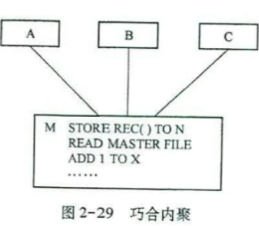

2. **逻辑内聚**

   把几种相关功能组合到一起，每次调用通过传递给模块的**判断参数**来决定执行哪一种功能

   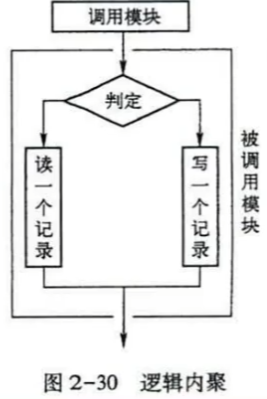

3. **时间内聚**

   又称**经典内聚**，基本为功能模块，模块中各功能执行**与时间相关**，通常要求所有功能必须在<font color="#F56C6C">同一时间段内执行</font>

   例如：定时任务

4. **过程内聚**

   模块内的处理是**相关的**，而且必须以**特定次序**<font color="#F56C6C">执行</font>

   A $\rightarrow$ B $\rightarrow$ C 必须按照ABC的顺序调用

5. **通信内聚**

   一个模块内个功能部分都使用了**输入数据**，或产生了<font color="#F56C6C">相同</font>的**输出数据** （虚线部分表示两个模块）

   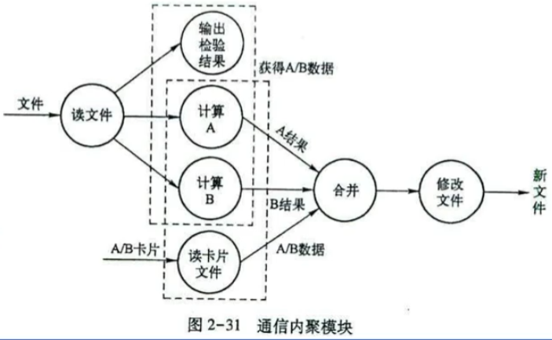

6. **顺序内聚**

   A[<font color="#F56C6C">输出</font>] $\rightarrow$ [<font color="#F56C6C">输入</font>]B $\rightarrow$ C

   模块内部处理的元素与同一功能密切相关，而且必须执行，<font color="#F56C6C">前一个功能的输出作为下一个功能的输入</font>，通常共用一个**数据结构**

7. **信息内聚**

   一个模块完成多个功能，每个功能都操作同一个数据结构，每一个功能有一个唯一的入口点

   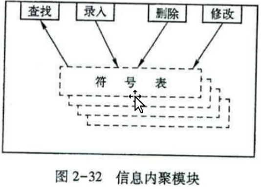

8. **功能内聚**：内聚程度<font color="#F56C6C">最高</font>

   模块中每个部分都是完成某一个功能必须的部分

   模块中的所有部分都是为了完成一项具体功能而协同工作，互相紧密联系，不可分割

### 设计文档

1. **概要设计说明书**
   1. 以图表形式表示软件的总体结构
   2. 模块的外部设计，包括关于各模块的功能，性能与接口的简要描述
   3. 数据结构设计，包括数据模式，访问方法和存储要求
2. **详细设计说明书**
   1. 表示软件结构的图表
   2. 对逐个模块程序的描述，包括标注和逻辑流程、输入/输出项、外部接口等

**文档的表达形式**

1. 图形表达工具：程序流程图、N-S图
2. 文字表达工具：伪代码
3. 表格表达工具

**HIPO图**= HC + IPO 图

HC表示软件的<font color="#F56C6C">分层结构</font>，HC中的每一个**模块**，均可用一张IPO图来描述

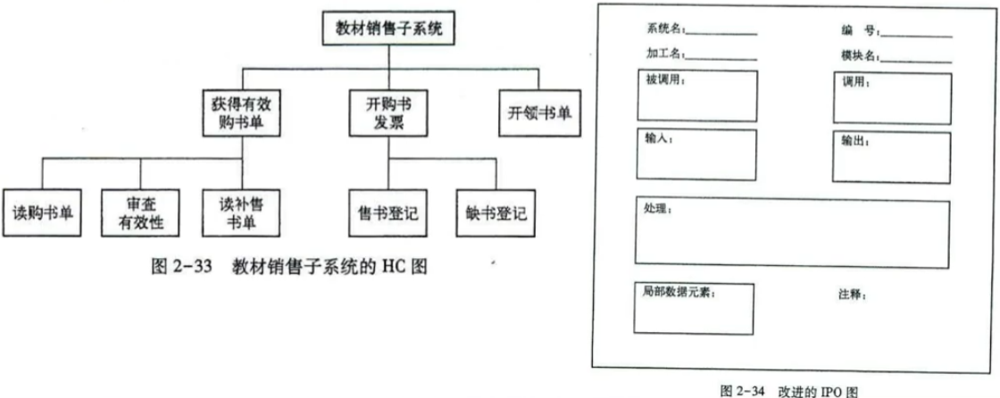

### 软件结构的典型形式

软件结构的典型形式分为<font color="#F56C6C">变换型</font>结构和<font color="#F56C6C">事务型</font>结构

1. **变换型结构**

   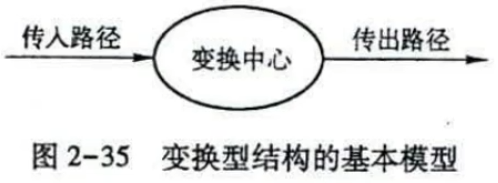

   由三部分组成，<font color="#F56C6C">传入路径、变换中心、传出路径</font>。流经这3部分的数据流分别为**传入流、变换流、传出流**

2. **事务型结构**

   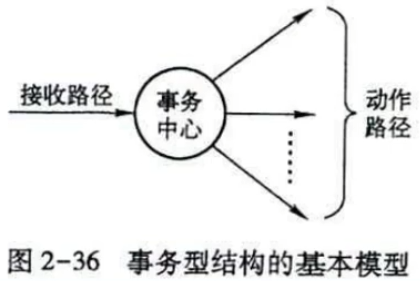

   具有多种事务中选择某类事务执行的能力。由<font color="#F56C6C">接收路径</font>（至少一条）、<font color="#F56C6C">事务中心</font>和<font color="#F56C6C">动作路径</font>（若干条）组成

### 结构图

<font color="#F56C6C">SC</font>（Structured Chart，结构图）：描述软件系统的模块结构

在SC中用矩形表示模块，用带箭头的连线表示模块间的调用关系。在调用线的两旁，应标出传入和传出模块的数据流

SC中的模块有4种类型，即传入模块，传出模块，变换模块和协调模块

**SC的组成**

1. 模块的表示符号

2. **简单调用**

    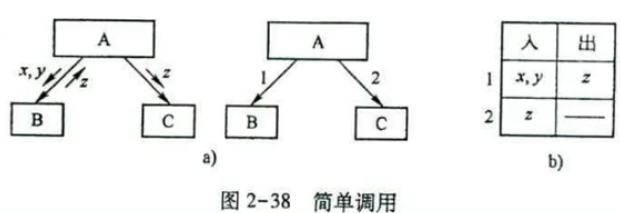

   表示模块A调用模块B和C，调用模块B时的传入参数是x,y，模块B向模块A返回的参数是z，调用模块C的时候传入参数是z，没有返回值

3. **选择调用**：菱形表示选择

   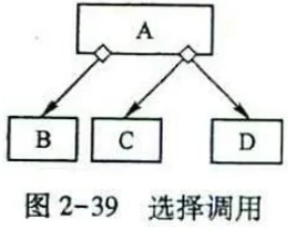

4.  **循环调用**：环形箭头表示循环

   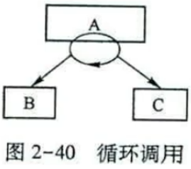


### 软件模块结构的改进

1. **模块功能的完善化**
   1. 执行规定功能部分
   2. 出错向调用者返回标志与原因
   3. 返回多数据时，附加成败标志
2. **消除重复功能，改善软件结构**
   1. 结构上完全相似，数据类型上不一致，合并模块，适配数据类型
   2. 局部相似，抽离公共部分为子模块，供原模块共享
   3. 设计功能可预测的模块，但要避免过分受限制的模块
   4. 模块的作用范围应该在控制范围之内
   5. 扇入和扇出。扇入 = 被调模块数，扇出 = 调用子模块数；减高扇出，随深度增扇入。高扇出 = 控制模块过多，高扇入 = 模块功能冗余。
   6. 模块的大小要适中

### 详细设计的目的与任务

详细设计的目的，是为软件结构图（SC或HC）中的每一个模块确定实现功能所采用的算法和数据结构，用某种工具给出清晰描述

**设计人员的任务**：

1. 选算法、写模块详细过程描述
2. 确定每个模块使用的数据结构
3. 定接口细节：含内外接口、输入输出及局部数据详情；
4. 设计测试用例：为编码后模块测试做准备。

### 模块的逻辑设计

**在详细设计阶段的原则**

1. 权衡效率与清晰，禁用 goto；

2. 结构化设计：用顺序 / 选择 / 循环，单入口单出口；

3. 逐步细化。逐步细化产生的程序逻辑一般错误较少，可靠性也比较高。

   1. 由粗到细，同步细化数据描述；
   2. 统一结构化语言，最终用伪代码；

   **优点**：聚焦重点、易验证正确性

### 常用的表达工具

1. **程序流程图**  **大题**

   是软件开发者最熟悉的一种算法表达工具，独立于任何一种程序设计语言

   **优点**：直观、清晰、易于学习

   **缺点**：符号不够规范

   1. **顺序型**

      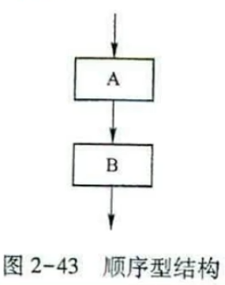

   2. **选择型**

      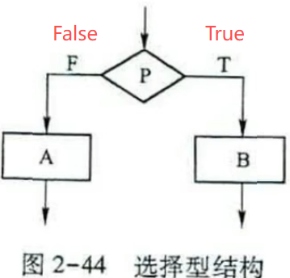

   3. **先判定型循环**（while）

      

   4. **后判定型循环**（do-while）

      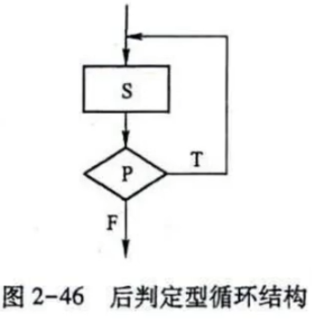

   5. **多情况型选择**

      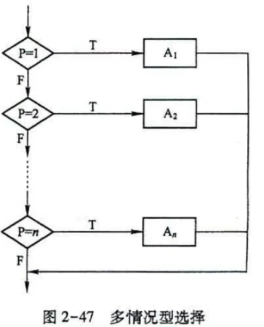

   **标准符号**

   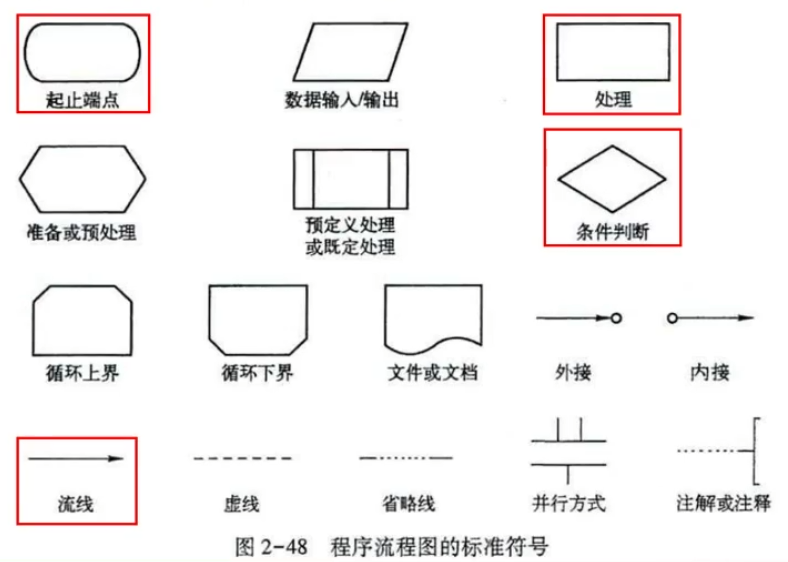

2. **N - S 图**  **大题**

   1. **顺序型**

      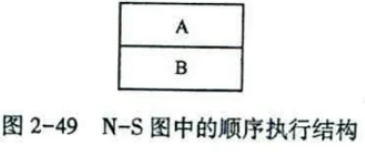

   2. **选择型**

      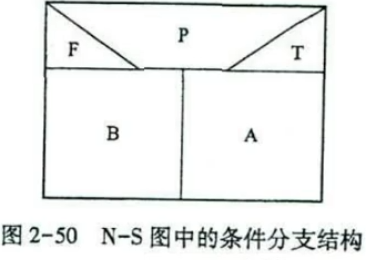

   3. **先判定型循环**

      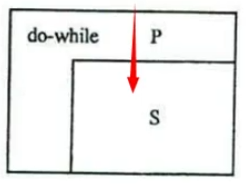

      P 判定条件

      S 循环体

   4. **后判定型循环**

      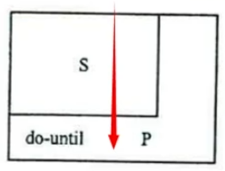

      P 判定条件

      S 循环体

   5. **多情况型选择**

      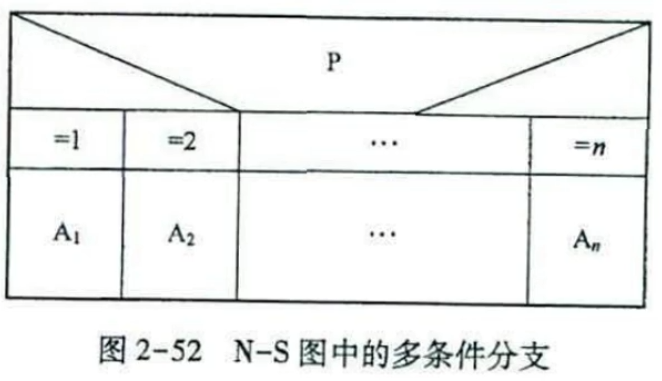

      

      

3. **PAD**

   1. **顺序型**：

      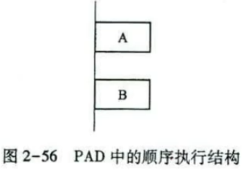

   2. **选择型**：

       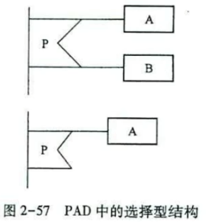

   3. **先判定型循环**：

      

   4. **后判定型循环**：

      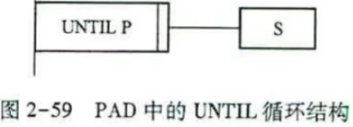

   5. **多情况型选择**：

       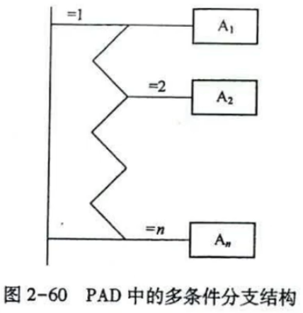

4. **伪代码和PDL**

   PDL是一种用于描述功能模块的算法设计和加工细节的语言，是一种伪代码。PDL作为一种伪代码，其语法分为内语法和外语法，内语法描述实际操作和条件，外语法描述控制结构和数据结构

   1. **数据说明**

      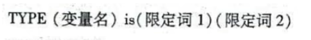

   2. **程序块**

      

   3. **子程序结构**

      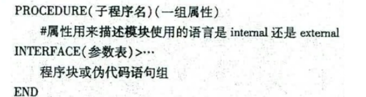

   4. **基本控制结构**

      1. **顺序型结构**

      2. **选择型结构**

         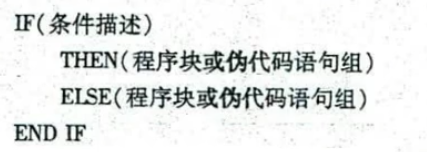

      3. **重复型结构**

         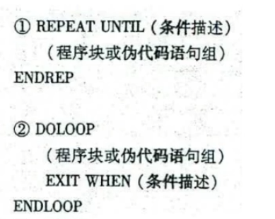

      4. **多路选择型结构**

         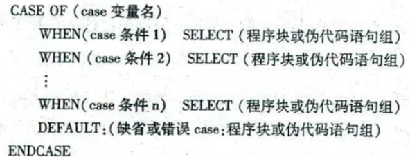

      5. **输入/输出结构**

         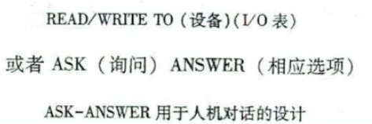

### 结构复杂度的度量

1. 核心：衡量程序清晰度与非结构化程度；

2. 度量方式：程序图、环域复杂度、交叉点复杂度；

3. 程序图：有向图 G=(N,E)，N = 结点，E = 有向边；

4. 环域复杂度 V (G)：
   $$
   V(G) = 判定节点数 + 1 \\
        = n_e - n_v + 2P\\
   (n_e 为有向图的边数，n_v 为有向图的结点数，P = 1)
   $$
   
5. 应用：

   1. 度量测试难度；
   2. 限制模块规模：V (G)≥10 测试极难，建议上限为 10。

<font color="#F56C6C"></font>

### 练习

1. 需求分析的任务是

   1. 确定客户需要目标系统实现的功能，并提供需求规格说明书
   2. 确定客户需要目标系统应该达到的时间性能，并提供需求规格说明书
   3. 确定客户需要系统提供什么样的用户界面，并提供需求规格说明书
   4. <font color="#F56C6C">确定目标系统的功能和非功能需求，并提供需求规格说明书</font>

2. 关于需求分析的步骤，下列选项中正确的是

   1. <font color="#F56C6C">先建立系统的业务模型，再建立系统的逻辑模型</font>
   2. 先建立系统的逻辑模型，再建立系统的业务模型
   3. 对业务系统模型进行完善后，再建立系统的逻辑模型
   4. 先对系统的逻辑模型进行完善，再建立业务系统的模型

3. 需求规格说明书中，用于对数据进行描述的工具是

   1. 数据流图
   2. 数据结构图
   3. <font color="#F56C6C">数据字典</font>
   4. 数据加工图

4. 下列关于 SC 的叙述，正确的是

   1. SC 通常用于描述模块的内部结构

   2. <font color="#F56C6C">SC 通常用于描述软件系统的模块结构</font>

   3. SC 由输入模块构成

   4. SC 由输出模块构成

5. 在结构化设计中，其模块的耦合性越低，模块的独立性 <font color="#F56C6C">2504</font>

   1. 越低
   2. <font color="#F56C6C">越高</font>
   3. 不变
   4. 无法确定

6. 在软件设计中，信息隐藏的主要目的是 <font color="#F56C6C">2504</font>

   1. 提高模块的耦合度
   2. 降低模块的内聚性
   3. <font color="#F56C6C">隐藏模块的实现细节</font>
   4. 提高系统的运行效率

7. 数据流图中，圆圈 O 代表加工，箭头 $\rightarrow$ 代表 <font color="#F56C6C">数据流向</font> <font color="#F56C6C">2504</font>

8. 如果一个模块内的处理过程是相关的，而且必须以特定次序执行，则称这个模块为<font color="#F56C6C">过程</font>内聚模块 <font color="#F56C6C">2504</font>

9. 在程序流程图中，用于表示预定义处理的图表是 <font color="#F56C6C">4</font>

   1. 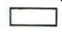

   2. 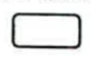

   3. 

   4. 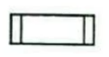

10. 下列图表中，可用于详细设计的是

   1. SC
   2.  <font color="#F56C6C">N - S 图</font>
   3. 数据流图
   4. 判定树

    <font color="#F56C6C">解析：</font>
    
    <font color="#F56C6C">需求分析</font>：数据流图、判定树、判定表
    
    <font color="#F56C6C">概要设计</font>：SC（结构图）
    
    <font color="#F56C6C">详细设计</font>：程序流程图、N - S 图、PAD、伪代码 PDL

11. 软件需求分析的任务是什么？需求分析的步骤是什么

    完全弄清用户对软件系统的确切要求，并用需求规格说明书的形式表达出来

    需求分析的步骤：

    1. 对现实环境进行调查研究，获得系统的具体模型
    2. 去掉具体模型中的分本质因素，抽象出当前系统的逻辑模型
    3. 分析当前系统与目标系统的差别，建立目标系统的逻辑模型
    4. 对目标系统进行完善与补充，写出完整的需求说明
    5. 对需求说明进行评审，直到确认文档齐全，符合用户需求

12. 需求规格说明书包括哪些内容？有哪些图、表可用于描述需求 <font color="#F56C6C">2504</font>

    需求规格说明书：引言、数据描述、功能描述、性能描述、质量保证

    可用于描述的图表：数据流图、数据结构图、数据字典、判定树、判定表

13. 简述模块的耦合性并列举三种耦合类型

    衡量模块间依赖程度的标准，接口复杂，调用方式紧密，传递数据多，耦合性就强

    非直接耦合、数据耦合、标记耦合、控制耦合、外部耦合、公共耦合

14. 银行计算机储蓄系统的工作过程大致如下：储户填写的存款单或取款单由业务员输入系统，如果是存款，则系统记录存款人姓名、住址（或电话号码）、身份证号码、存款类型、存款日期、到期日期、利率及密码（可选）等信息，并打印出存款存单给储户；如果是取款而且存款时留有密码，则系统首先核对储户密码，若密码正确或存款时未留密码，则系统计算利息并打印出利息清单给储户。请用数据流图描绘本系统的功能

    记录信息时生成了存款信息，所以需要指出生成的文件

    

15. 画出下列伪代码程序的程序流程图和盒图

    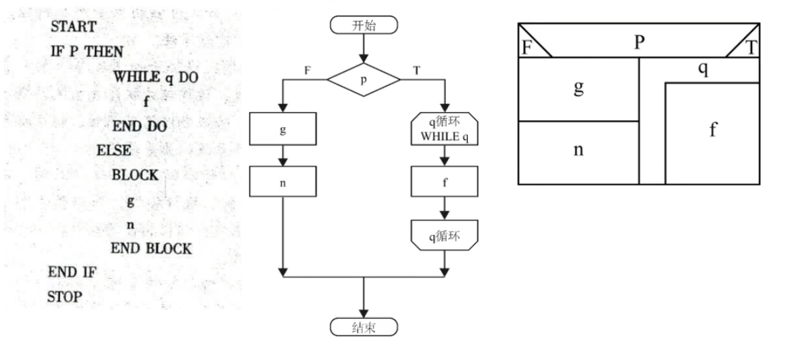

16. 画出下列伪代码程序的数据流程图和N-S图

    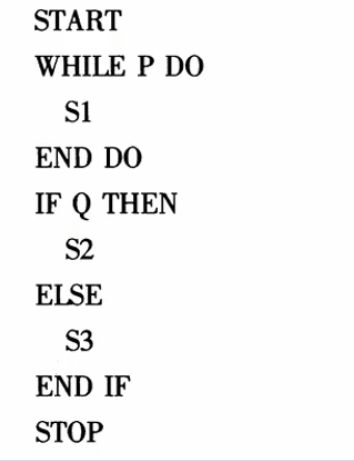

## 第三章 面向对象的软件开发方法

### 面向对象的基本概念

1. **对象**：

   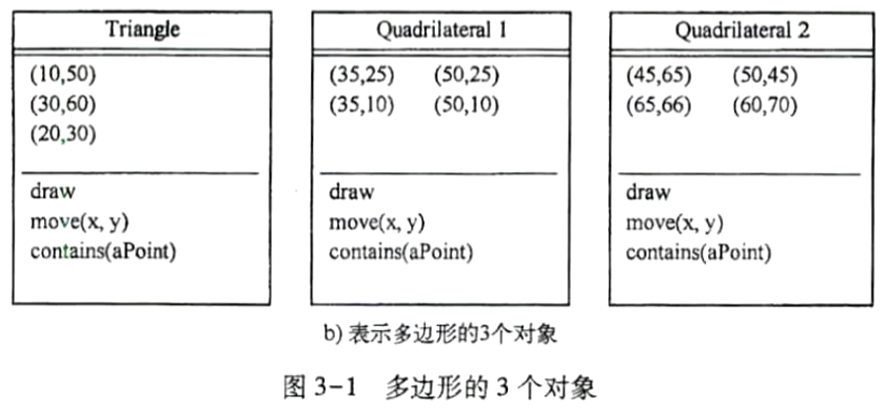

   1. 构成：封装 “属性（数据）+ 操作（方法 / 成员函数）” 的统一体；
   2. 规则：属性仅能通过对象自身的操作修改；
   3. 操作作用：描述对象能实现的功能（C++ 中称成员函数）

2. **类**：同数据结构 + 同操作的对象集合，含属性 + 合法操作，对象是类的实例；

3. **封装**：属性 + 服务封装为独立单元（信息隐藏），外部可见特征、隐蔽内部细节。

   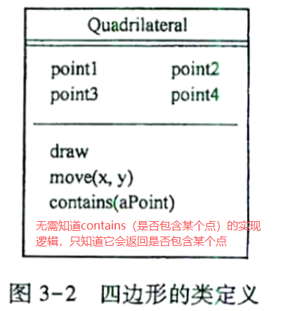

4. **继承**：子类由父类派生，自动继承父类全部属性和服务

5. **多态性**：子类可当父类用（C++ 靠虚函数实现），即 “一种方法，多种实现”。

   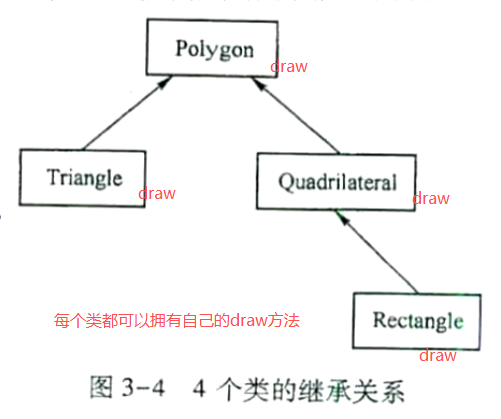

6. **重载**：函数重载与运算符重载。C++中，函数重载通过静态联编实现

   1. **函数重载**：

      ```
      // 模拟 add 函数重载（通过判断参数类型/数量分支执行）
      function add(...args) { // ...args 接收所有传入的参数（数组形式）
        const [a, b, c] = args; // 解构参数
      
        // 1. 2个参数：区分整数/小数
        if (args.length === 2) {
          // 判断是否为整数（C++ 中的 int 类型）
          if (Number.isInteger(a) && Number.isInteger(b)) {
            console.log(`整数相加：${a} + ${b} = ${a + b}`);
            return a + b;
          }
          // 判断是否为小数（C++ 中的 double 类型）
          else if (typeof a === 'number' && typeof b === 'number') {
            const result = (a + b).toFixed(2); // 保留 2 位小数
            console.log(`小数相加：${a} + ${b} = ${result}`);
            return Number(result);
          }
        }
      
        // 2. 1个参数：自加 10
        else if (args.length === 1 && typeof a === 'number') {
          console.log(`单参数自加 10：${a} + 10 = ${a + 10}`);
          return a + 10;
        }
      
        // 3. 3个参数：三数求和
        else if (args.length === 3 && args.every(x => typeof x === 'number')) {
          console.log(`三数求和：${a} + ${b} + ${c} = ${a + b + c}`);
          return a + b + c;
        }
      
        // 不匹配的情况
        else {
          throw new Error('参数类型/数量不匹配，无对应重载逻辑');
        }
      }
      
      // 测试不同「重载」场景
      add(1, 2);          // 整数相加：1 + 2 = 3（匹配 int 类型重载）
      add(1.5, 2.3);      // 小数相加：1.5 + 2.3 = 3.80（匹配 double 类型重载）
      add(5);             // 单参数自加 10：5 + 10 = 15（匹配 1 个参数重载）
      add(10, 20, 30);    // 三数求和：10 + 20 + 30 = 60（匹配 3 个参数重载）
      // add('a', 1);      // 报错：参数类型不匹配（无对应重载）
      ```

   2. **运算符重载**：

      ```javascript
      // 定义一个「坐标类」（类似 C++ 的 class）
      class Point {
        constructor(x, y) {
          this.x = x; // 坐标 x 属性
          this.y = y; // 坐标 y 属性
        }
      
        // 模拟「+ 运算符重载」：用函数代替运算符，实现自定义相加逻辑
        // 对应 C++ 中的 operator+(const Point& other)
        add(other) {
          // 自定义逻辑：两个 Point 对象的 x、y 分别相加，返回新 Point
          return new Point(this.x + other.x, this.y + other.y);
        }
      
        // 辅助方法：打印坐标（方便查看结果）
        toString() {
          return `Point(${this.x}, ${this.y})`;
        }
      }
      
      // 测试「运算符重载」效果
      const p1 = new Point(1, 2); // 第一个坐标对象
      const p2 = new Point(3, 4); // 第二个坐标对象
      
      // 模拟「p1 + p2」的效果（C++ 可直接写 p1 + p2，JS 用 p1.add(p2) 模拟）
      const p3 = p1.add(p2);
      console.log(`p1 "加" p2 的结果：${p3}`); // 输出：p1 "加" p2 的结果：Point(4, 6)
      
      // 再扩展：模拟「- 运算符重载」（坐标相减）
      Point.prototype.subtract = function(other) {
        return new Point(this.x - other.x, this.y - other.y);
      };
      const p4 = p2.subtract(p1);
      console.log(`p2 "减" p1 的结果：${p4}`); // 输出：p2 "减" p1 的结果：Point(2, 2)
      ```

### 统一建模语言UML

UML（统一建模语言）是通用可视化建模语言，用于软件系统的描述、可视化、构造与文档化，覆盖需求分析、设计、维护等全生命周期，适用于计算机软件、固件或数字逻辑构成的离散系统建模。

### 用例图

用于表示系统的功能

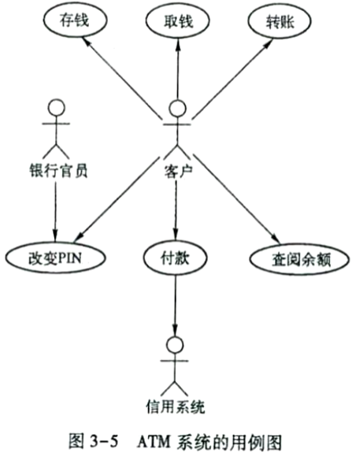

### 时序图

用于表示<font color="#F56C6C">业务过程的细节</font>

只显示对象不显示类

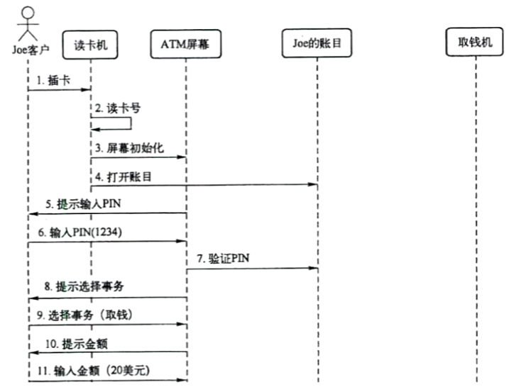

### 协作图

用于显示对象间<font color="#F56C6C">处理过程的分布</font>

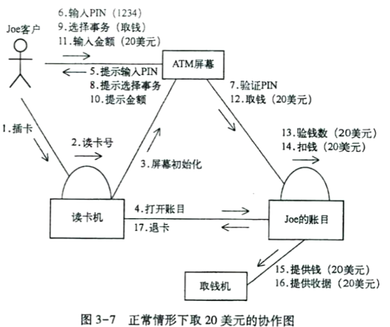

### 类图

显示系统中<font color="#F56C6C">类与类之间的相互关系</font>。提供了类及其相互关系的<font color="#F56C6C">静态图形</font>

每个类用<font color="#F56C6C">方框</font>表示，分成三部分

1. <font color="#F56C6C">类名</font>
2. 类包含的<font color="#F56C6C">属性</font>
3. 类的<font color="#F56C6C">操作</font>

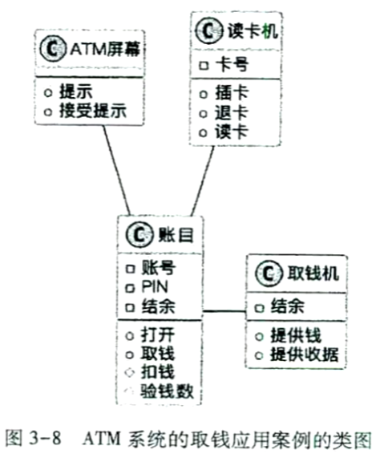

### 状态图

显示<font color="#F56C6C">对象的功能</font>

为对象的<font color="#F56C6C">各种状态提供了建模方式</font>

对系统的<font color="#F56C6C">动态功能</font>进行建模

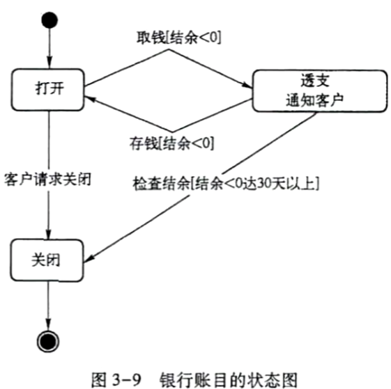

### 组件图

显示模型的<font color="#F56C6C">物理视图</font>

显示系统中的<font color="#F56C6C">软件组件及其相互关系</font>

有两种组件： <font color="#F56C6C">执行组件、代码库</font>

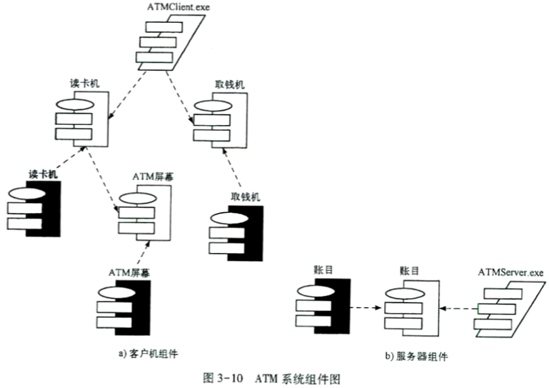

### 部署图

显示网络的<font color="#F56C6C">物理布局</font>和<font color="#F56C6C">各种组件的</font>位置

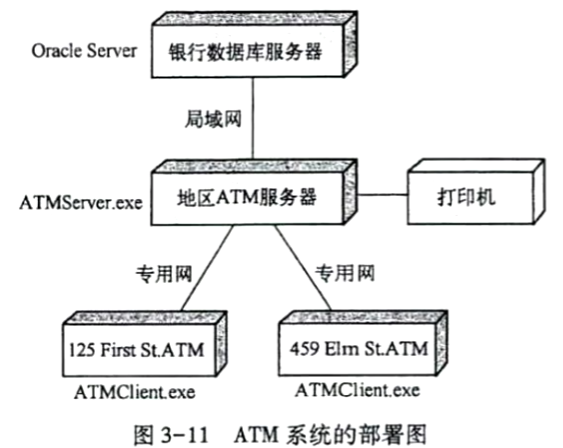

### 上下文模型

表示<font color="#F56C6C">目标系统</font>与<font color="#F56C6C">其他外部系统</font>的关系，外部系统可能产生数据供目标系统使用，同时也使用该系统产生的数据

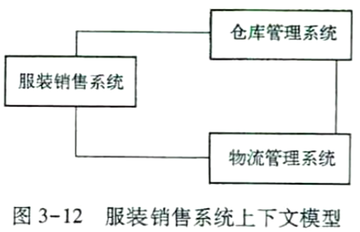

### 面向对象的需求分析

面向对象分析与设计中，通过抽取、整理用户需求建立多维度问题域精确模型，常用 UML 作为建模语言。主要使用以下五种图

1. 活动图
2. 用例图
3. 时序图
4. 类图
5. 状态图

### 面向对象的建模步骤

基于用例实现的面向对象的建模由以下几个步骤组成：

1. 沟通用户，明确核心需求
2. 界定系统边界与外部交互，建立上下文模型；
3. 梳理业务流程，构建活动图；
4. 从用户交互视角提炼功能，建立用例模型；
5. 识别实体对象 / 类（属性、方法、层次关系），搭建静态结构模型；
6. 基于用例，用时序图描述对象交互关系；
7. 分析对象行为与状态变化（状态图），完善类图；
8. 迭代上述步骤，直至模型闭环

### 基于业务流程的活动图

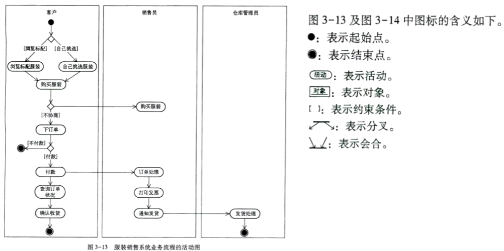

### 用例图与系统功能

每一个信息系统的用例代表着一个完整的功能

**用例图规范**：

1. **用例**：椭圆形表示
2. **执行者**：棒状小人图形
3. **关联**：执行者和用例之间带箭头的线 【<font color="#F56C6C">实线</font>】
4. **用例间的包含关系**：用例与用例之间带箭头的线 【<font color="#F56C6C">虚线</font>】

**从业务流程到用例图建模**

1. 利用与用户的对话<font color="#F56C6C">找出系统的用例</font>
2. <font color="#F56C6C">画用例图</font>
3. 完成<font color="#F56C6C">用例的描述</font>

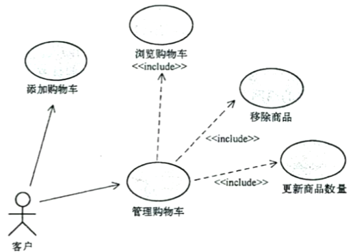

### 类图与静态结构

类图用于描述系统的静态结构，可以自动转换为程序代码

**对象模型的类包括**

1. **实体类**：问题域中的核心类
2. **边界类**
3. **控制类**

**类图规范**

1. **类**（Class）

   1. 类名

   2. 属性

   3. 操作

      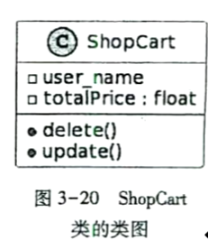

2. **关联**：类与类之间最基本的关系

   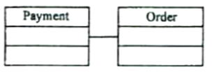

3. **泛化**：两个类之间**一般**与**特殊**的关系（<font color="#F56C6C">子类与父类的关系</font>）

   <font color="#F56C6C">Saler 与 Customer 是一般</font>

   <font color="#F56C6C">sysUser 是特殊</font>

   

4. **整体-部分关系**

   1. **聚合**：类可以独立存在

      

   2. **组合**：类之间只能共存，不可以相互独立

      

5. **依赖关系**：没有结构上的关联，一般称为弱相关

   提交页面管收集用户输入，订单管业务数据和规则，俩是各干各的，就提交时传个数据，内部怎么变互相不影响，所以是弱相关。

   

6. **多重性**：通常在关联或整体-部分关系中会加以使用，代表着对象关系结构中，彼此能够允许的最少及最多的数量

   一辆汽车最少要有4个论讨，最多可以有8个轮胎，汽车与轮胎间的多重性就是4~8

   

### 类图与静态结构

**类图建模基本步骤**：

1. 识别类与对象
2. 识别属性
3. 识别操作
4. 识别关联

### 时序图与交互模型

**时序图的主要任务**：

1. 画清程序运行时，各个对象怎么配合干活；
2. 检查类图设计对不对（时序图里的东西都得在类图里有）；
3. 给程序员铺路，按时间顺序写代码就行

**时序图规范**：

1. 对象
2. 消息
3. 生命线

每个对象生命线上的狭长矩形是活动棒，在活动棒内的所有消息之间存在清晰时序关系


### 状态图与事件驱动模型

事件驱动模型表示系统内对外部事件的响应方式，事件引起<font color="#F56C6C">一种状态向另一种状态的转变</font>

**状态图规范**：

1. 起始状态：用实心黑色圆形表示
2. 结束状态：用空心黑色圆形表示
3. 状态：圆角矩形
4. 迁移：箭头
5. 事件触发器：箭头上的文字


**识别对象状态空间的步骤**：

1. 明确对象从创建到消亡的完整生命周期；
2. 确定按什么规则划分生命周期；
3. 按规则拆分阶段，得到初步候选状态；
4. 梳理各状态下的对象动作，调整状态（合并 / 拆分）；
5. 明确是什么数据属性决定了对象处于该状态；
6. 校验：每个状态都能明确判定，且状态之间互不冲突。

### 面向对象软件设计概述

**面向对象软件设计需要完成的工作**：

1. 数据/类设计
2. 体系结构设计
3. 接口设计
4. 构件设计

**面向对象软件设计的基本步骤**：

1. 建模系统 / 产品的整体体系结构
2. 设计各类接口（连接用户、外部系统、内部构件）；
3. 详细设计软件构件的实现细节。

### 面向对象的设计准则

1. 模块化
2. 抽象
3. 信息隐蔽
4. 低耦合
5. 高内聚
6. 可复用

### 体系结构设计

1. **分层体系结构**：局部修改不影响整体系统，低耦合；

2. **三层架构**：界面层、业务逻辑层、数据访问层

3. **采用MVC模式的Web体系结构**

   **核心**：按业务逻辑、数据、界面显示分离组织代码，核心部件为视图（界面）、控制器（交互调度）、模型（数据 / 业务逻辑）；

   **MVC优点**：耦合低、重用性高、开发效率高、可维护性强。

### 体系结构设计

系统逻辑结构与类包图：

**包图规范**：

1. 包
2. 依赖关系


**系统物理体系结构与构件图**：


**物理体系结构与部署图**：

**部署图规范**：

1. 节点：运行时，计算机物理元素

2. 构件

   

### 构件级设计

数据、体系结构和接口设计构成了构建级设计的基础

1. 从分析类到设计类

2. 从用例场景到设计类

   分析类 + 设计模式 = 设计类

3. 构件详细类图建模

### 用户界面设计

**界面设计的规则**：

1. 控制权交给用户
2. 减轻用户记忆负担
3. 保持界面一致


<font color="#F56C6C"></font>

### 练习

1. 下列关于对象与类的关系的描述中，正确的是
   1.  <font color="#F56C6C">对象是类的一种实例</font>
   2. 对象是类中的操作
   3. 对象是类的封装
   4. 对象是类中的属性

2. 下列选项中，适合作为类的属性的是
   1. 学生
   2. 计算机
   3. 服装
   4.  <font color="#F56C6C">手机型号</font>

3. 下列选项中，适合作为类或对象的是
   1.  <font color="#F56C6C">员工</font>
   2.  员工姓名
   3.  员工所属部门
   4.  员工身份证号

4. 下列关于用例图的叙述中，正确的是
   1. 用例图用于描述系统的业务
   2. 用例图用于表示系统中类的构成
   3.  <font color="#F56C6C">用例图用于描述系统的功能</font>
   4. 用例图用于表示系统的状态变化

5. 下列选项中，用于显示对象间处理过程分布的图是
   1.  <font color="#F56C6C">协作图</font>
   2. 部署图
   3. 时序图
   4. 状态图

6. 在需求分析阶段表示目标系统与其他外部系统的关系的模型是
   1. 系统的静态模型
   2. <font color="#F56C6C">上下文模型</font>
   3. 系统的组件模型
   4. MVC模型

7. 下列关于MVC模式的叙述中，正确的是

   1. MVC 用视图、数据、操作三个部分组织程序
   2. MVC 模型将系统分为界面层、业务逻辑层和数据访问层
   3. <font color="#F56C6C">MVC 将应用程序划分为视图、控制器、模型三个核心部件</font>
   4. MVC 应用程序被分成用户界面、计算程序、输出程序三个核心部分

8. 类图中每个类用方框表示，分成三部分，分别是  <font color="#F56C6C">202504</font>

   1. 类名、属性和操作
   2. <font color="#F56C6C">类名、对象和操作</font>
   3. 类名、属性和对象
   4. 对象、属性和操作

9. 下列哪项不属于时序图的元素    <font color="#F56C6C">202504</font>

   1. 对象
   2. 生命线
   3. <font color="#F56C6C">对象的属性</font>
   4. 消息

10. 在 C++ 中，对象的<font color="#F56C6C">数据流向</font>称作成员函数   <font color="#F56C6C">202504</font>

11. 在 C++ 语言中，多态性是通过<font color="#F56C6C"></font>函数来实现的   <font color="#F56C6C">202504</font>

12. UML 中的<font color="#F56C6C"></font>图是显示网路的物理布局和各种组件的位置   <font color="#F56C6C">202504</font>

13. 通常意义上的三层架构就是将整个业务应用划分为界面层、业务逻辑层和<font color="#F56C6C"></font>   <font color="#F56C6C">202504</font>

14. 继承是指一个类的定义中可以派生出另一个类的定义，派生出的类被称作<font color="#F56C6C"></font>    <font color="#F56C6C">202504</font>

15. 封装   <font color="#F56C6C">202504</font>

16. 简述类图中组合关系的含义   <font color="#F56C6C">202504</font>

17. 简述面向对象设计准则   <font color="#F56C6C">202504</font>

18. 客户的网上购物用例图如题 33 图，请根据用例图完成下列任务。    <font color="#F56C6C">202504</font>

    

    1. 图中有几个用例
    2. 请给出网上购物系统的需求描述
    3. 包含关系发生在哪些用例之间


## 第四章 移动应用设计与测试

### 移动应用的特点

1. 强调用户体验
2. 需求及环境的复杂性
3. 技术难度更高
   1. 多元化的硬件和软件平台：移动平台、固定平台
   2. 多种开发框架和程序设计语言
   3. 多种具有不同规则和工具的应用商店
   4. 开发周期短
   5. 用户界面的限制以及传感器与设备之间交互的复杂性
   6. 环境的有效利用
   7. 电源管理。背光、存储器读写、无线网络连接的使用、专业硬件设备的利用以及处理器速度都会影响到电池的使用这些都是软件开发者需要考虑的因素
   8. 安全保密性、隐私模式和策略
   9. 计算和存储限制
   10. 依赖外部服务的应用
   11. 测试的复杂性

### 移动应用的开发过程

移动应用采用敏捷开发模型，开发过程如下：

1. **需求分析阶段**
2. **设计阶段**：**体系结构设计**、**导航设计**、**界面设计**以及**内容设计**
3. **开发**
4. **稳定阶段**
   1. alpha原型，包含最小可行产品功能
   2. beta原型，它已基本完成并包含大部分通过测试的功能
   3. 候选发布版，包含所有必须的功能，所有计划的测试均已完成
5. **部署阶段**

### 移动应用的界面设计

1. **平台模型**：明确支持平台的约束条件
2. **表示模型**：定义用户界面的外观样式
3. **任务模型**：结构化呈现用户达成目标需执行的任务

### 设计移动应用程序的方法

1. 使用场景
2. 观察不同应用者
3. 低保真度的纸质原型（卡片\便条）

移动APP设计要避免：功能复杂、前后矛盾、设计过度、加载过慢、废话连篇、非标准交互、对常见问题的回答和帮助

### 云计算体系结构

分为三层，每一层都可以称为一个服务。用户控制程度由弱到强

1. **软件即服务（SaaS）层**：第三方服务提供商提供的软件构件和引用

   例如微信、钉钉、金蝶、蓝湖等

2. **平台即服务（PaaS）层**：提供协同开发平台，帮助地理信息分散的团队成员进行设计、实施和测试

   借助谷歌平台、微软平台、阿里云平台等提供的容器方便搭建分布式服务

3. 基础设施即服务（laaS）层：为云计算提供虚拟计算资源（存储、处理能力、网络连接）

   企业按需租借虚拟机，自主安装操作系统、部署数据库与应用

### WebApp设计的内容

1. **内容设计**：

   1. 统一窗口风格与交互
   2. 引导式交互 + 操作反馈
   3. 按优先级 / 主题组织内容 + 辅助导航

2. **美学设计**：

   1. 留白，内容优先
   2. 左上到右下布局，分导航 / 内容 / 功能区
   3. 核心内容限可视区，适配分辨率与浏览器

3. **内容设计**：

   1. WebApp 内容对象与传统软件数据关联更紧密
   2. 包含两类属性
      - 内容信息属性：建模时定义的核心数据
      - 实现属性：作为设计成分的展示 / 配置属性

4. **体系结构设计（MVC）**

   1. 模型：业务逻辑 + 数据管理
   2. 视图：仅渲染展示数据
   3. 控制器：接收请求，调度模型反馈视图

5. **导航设计**

   按用户群体定导航语义（菜单、按钮、链接、操作栏）

6. **构件设计**

   1. 单一职责：内容处理或数据计算
   2. 聚合封装，统一接口，便于复用

### 移动App质量属性

最终用户对于移动App的满意度取决于6个重要的质量因素

1. **易用性**

2. **功能性**

3. **可靠性**

4. **时效性**

5. **可维护性**

6. **可移植性**

   安全性、可用性、可扩展性、投放市场的时间、内容的质量作为扩展的质量属性，用于对移动应用的质量进行评价

### 测试策略

1. **用户体验测试**

   早期用户参与，保障多设备易用、可访问

2. **设备兼容性测试**

   验证软硬件组合下正常运行

3. **性能测试**

   检查下载、处理器、存储、功耗等设备特有需求

4. **连接性测试**

   确保访问网络 / 服务，容忍弱网、断网

5. **安全性测试**

   保护用户隐私与安全

6. **自然环境测试**

   真实设备、全球网络环境实测

7. **认证测试**

   符合分发机构标准

**用兼性连，安自认**

### 用户体验测试相关问题

1. **手势测试**：

   自动化难（屏显、操作影响对象位置），需开发测试框架（昂贵费时），要考虑屏幕差异

   当使用移动App测试手势时，要考虑屏幕差异

2. **虚拟键盘输入**

   激活时易遮挡屏幕

3. **语音输入和识别**

   测试质量可靠性，需考虑环境条件、个体语音差异

4. **警报和异常条件**

   实时环境中，弱网、来电、短信、日历提醒等会影响 App 行为

**手键语警**

### WebApp 测试策略

1. **内容测试**
   1. **检查语法**、语义、内容组织 / 结构错误
   2. **常见实例**：
      1. 语法错误：按钮文字多字漏字（如 “立即下订” 应为 “立即下单”）、文案标点混乱；
      2. 语义错误：提示语歧义（如 “订单失效” 写成 “订单失败”，误导用户以为支付失败）；
      3. 结构错误：商品分类层级混乱（“手机配件” 里混入 “笔记本电脑”）、帮助文档章节逻辑颠倒。
2. **界面测试**：
   1. 排查界面机制、导航语义实现、功能及内容显示错误
   2. 常见实例：
      1. 界面机制错误：弹窗关闭按钮点击无反应、下拉菜单无法展开；
      2. 导航语义错误：点击 “我的订单” 跳转到 “商品列表”、面包屑导航层级与实际页面不符；
      3. 显示错误：不同分辨率下按钮被截断、图片拉伸变形、文字重叠遮挡。
3. **导航测试**： 
   1. 验证所有导航机制可用，确保用户能获取对应导航单元
   2. 常见实例：
      1. 导航功能故障：侧边栏导航点击无响应、分页按钮 “下一页” 失效；
      2. 权限问题：普通用户能看到仅管理员可见的 “后台配置” 导航入口、未登录用户点击 “我的收藏” 无引导跳转。

### 其他测试

1. **安全性测试**：

   用防火墙、鉴定、加密、授权技术抵御各类攻击

2. **性能测试**：

   全流程测试集成环境下软件性能，定位服务器、带宽、数据库、设计等引发的性能问题

3. **实时测试**：

   在真实用户环境 / 自然环境中，用生产版本 App 开展测试

4. **测试人工智能子系统**：

   1. **静态测试**：专家评审验证
   2. **动态测试**：运行源代码 + 测试用例确认
   3. **基于模型的测试**：黑盒测试技术

5. **虚拟环境测试**：

   1. **α测试**：用户在开发者场地测，开发者在场
   2. **β测试**：用户在自己场地测，开发者不在场

   涵盖：可用性、可访问性、可玩性测试

6. **文档测试**：

   1. **技术评审**，检查文档清晰度
   2. **现场测试**，结合实际程序使用文档

**安性实人虚文**

### 练习

1. 下列选项中，移动应用不同于传统应用程序的特点是
   1. 应用与网络相关
   2. 需要友好的用户界面
   3. 需要采用工程化方法进行应用开发
   4. <font color="#F56C6C">移动应用需要支持更多样化的人机交互方式</font>
2. 关于开发移动应用技术的叙述中，正确的是
   1. 由于移动设备资源有限，因此开发移动应用适合采用机器级语言
   2. 由于移动设备硬件的多样性，因此应该在移动硬盘上直接开发移动应用
   3. <font color="#F56C6C">针对不同平台的移动应用需要在不同的环境下分开开发</font>
   4. 移动应用的规模较小，因此其开发适合采用瀑布模型
3. 下列选项中，正确的移动应用开发的5个迭代阶段是
   1. 可行性分析、需求分析、设计、测试、维护
   2. 需求分析、设计、编码、测试、维护
   3. 需求分析、设计、编码、稳固、部署
   4. <font color="#F56C6C">需求分析、设计、开发、稳固、部署</font>
4. 下列选项中，用于描述用户界面的模型是
   1. <font color="#F56C6C">任务模型</font>
   2. 内容模型
   3. 接口模型
   4. 设计模型
5. 移动计算环境的层次按照由强到弱控制的顺序，3个层次依次为
   1. 软件即服务层、平台即服务层、基础设施即服务层
   2. <font color="#F56C6C">基础设施即服务层、平台即服务层、软件即服务层</font>
   3. 平台即服务层、软件即服务层、基础设施即服务层
   4. 软件即服务层、基础设施即服务层、平台即服务层

6. 下列选项中，WebApp 界面设计中的美学设计不需要关注的是
   1. 用户界面的功能
   2. 用户界面的内容
   3. 用户界面的布局
   4. <font color="#F56C6C">用户界面的响应时间</font>

7. 导航语义单元是
   1. 一个导航页面
   2. 一组关于导航信息的集合
   3. 一组导航选项
   4. <font color="#F56C6C">信息和相关的导航结构的集合</font>

8. 关于手势测试，下列叙述正确的是
   1. 手势测试对于所有的移动设备都是必需的
   2. 通过自动化工具来完成手势测试是效率较高的方法
   3. <font color="#F56C6C">手势测试需要考虑移动设备屏幕大小的差异</font>
   4. 手势测试的结果不会影响移动应用的可访问性
9. 下列哪个不是移动应用开发框架
   1. 苹果
   2. 安卓
   3. Windows
   4. <font color="#F56C6C">C 语言</font>

10. 移动应用开发的5个迭代阶段包括：需求分析阶段、<font color="#F56C6C">设计阶段</font>、开发阶段、稳定阶段和部署阶段

## 第五章 软件测试

### 软件测试的步骤和对象

1. **定义**：按开发各阶段规格说明 + 程序内部结构设计测试用例，运行程序发现潜在错误的过程
2. **基本步骤**：
   1. 单元测试：`编码阶段`
   2. 组装测试：测试阶段
   3. 确认测试：测试阶段
   4. 系统测试：测试阶段
3. **目的**：发现错误（不保证程序无错
4. **测试对象**：需求分析说明、概要 / 详细设计规格说明、源程序

### 软件测试的原则

1. 尽早 + 持续测试，降低纠错成本
2. 测试用例 = 输入数据 + 预期输出
3. 程序员避免自测
4. 用例覆盖合理 + 不合理输入
5. 关注错误群集现象
6. 严格执行测试计划，杜绝随意性
7. 全面检查结果，对高错误程序反复测
8. 保存测试文档，助力软件维护

**尽早用例避自测，覆盖群集遵计划，全检文档助维护**

### 软件测试的方法

1. **静态测试**：无需执行被测程序

2. **动态测试**：需执行被测程序

   1. **黑盒测试**：

      将程序视作黑盒，不关心内部结构，仅依据外部功能设计用例，验证功能正确性，又称**功能测试**

      **设计测试用例的步骤**：

      1. 建立等价类表
      2. 给每个等价类编号
      3. 设计新用例，尽可能多覆盖**有效等价类**，直至全覆盖
      4. 设计用例，每次覆盖一个**无效等价类**，直至全覆盖

      **黑盒功能不看芯，等价编号效先尽，无效逐个全覆盖**

      **等价类的划分**：

      【例 1】求整数绝对值的程序，其输入域为所有的整数，将这一输入域划分为正数、负数、0三个部分、然后用一个整数6、一个负数6和0作为测试用例的输入值进行功能测试。在等价类正数中任意取一个正数，在等价类负数中取一个负数，它们对于揭露程序中的错误都是等效的

      1. **等价类**：指某个输入域的子集  [-2,2] 子集 -1 0 1
      2. **有效等价类**：合理的、有意义的输入数据构成的集合    比如 [-2,2] 合理：-1
      3. **无效等价类**：不合理的、无意义的输入数据构成的集合 比如 [-2,2] 不合理 3

   2. **白盒测试**：

      聚焦代码级，需要了解程序内部构造，根据逻辑设计测试用例，检查语句、路径、条件，验证代码是否符合需求规范

      **测试用例设计**：

      1. **逻辑覆盖**
      ```c
      #include <stdio.h>
      int main () {
          int A,B,X;
          scanf("%d%d%d",&A,&B,&X);
          if(A > 1 && B == 0) {
              X = X / A;
          }
          if(A == 2 || X > 1) {
              X = X + 1;
          }
          printf("A = %d, B = %d, X=%d\n",A,B,X);
          return 0;
      }
      ```
      
      
      
      <font color="#F56C6C">**if 是判定，if中的语句是条件**</font>
      
      1. **逻辑覆盖**：
      
         1. **语句覆盖**：使被测程序的每条语句都执行至少一次（A > 1、B = 0、A = 2、x > 1）都是语句，这4条语句都能覆盖
      
            <font color="#F56C6C">**让{}中的代码执行一次即可**</font>
      
            
      
         2. **判定覆盖**：使被测程序的每个判断分支取真取假各执行一次
      
            <font color="#F56C6C">**让整个if的判定结果(真/假)都走一次**</font>
      
            判定1：(A > 1) && (B = 0)  这个整体是判定
      
            判定2：(A = 1) || (X > 1) 这个整体是判定
      
            
      
         3. **条件覆盖**：条件覆盖使被测程序的每个条件都按真和假执行至少一次
      
            <font color="#F56C6C">**让判定里的每个条件(真/假)都走一遍**</font>
      
            判定1：(A > 1) 或者 (B = 0) 这个小条件是条件
      
            判定2：(A = 2) 或者 (X > 1) 这个小条件是条件
      
            
      
         4. **判定-条件覆盖**：被测程序的每个判断中的每个条件都按“真” “假” 取值各执行一次，同时每个判断都按真 假 取值各执行一次
      
            <font color="#F56C6C">**判定的真假 + 每个条件的真假，都要覆盖到**</font>
      
            两个条件为真，判定就为真
      
            两个条件为假，判定就为假
      
         5. **条件组合覆盖**：条件组合覆盖测试是使每个判断的所有可能的条件取值都至少执行一次。4个条件，分真假，8种组合
      
            <font color="#F56C6C">**让所有条件的真假组合都要出现一次，并且每个组合都要对应到判定的结果（真 / 假）。**</font>
      
            1、A > 1, B = 0 真真； 2、A > 1, B != 0 真假
      
            3、A <=1, B = 0 假真；4、A <=1, B != 0 假假
      
            5、A = 2, X > 1 真真；6、A = 2, X <= 1 真假
      
            7、A != 2, X > 1假真；8、A != 2, X <= 1 假假
      
            
      
         6. **路径覆盖**：测试用例覆盖程序中所有可能的路径
      
            真真(a, c, e)
      
            假假(a, b, d)
      
            假真(a, b, e)
      
            真假(a, c, d)
      
            所有路径：$2^2 = 4$
      
            
      
      2. **基本路径测试**
      
         路径覆盖测试技术就是设计足够多的测试用例，覆盖程序中所有可能的路径
      
         <font color="#F56C6C">测试覆盖的路径数控制在一定限度内</font>
      

### 边界值分析

首先应该确定边界情况

通常，输入等价类与输出等价类的边界就是应该重点测试的边界情况

应当选取正好等于、刚刚大于或刚刚小于边界值作为测试数据

边界值分析方法选择测试用例的原则如下：

1. 如果输入条件规定了值的范围，则应取刚达到这个范围的边界值，以及刚刚超越这个范围的边界值作为测试输入数据

   **例如**：输入范围[-1.0,1.0]，则可选取-1.0、1.0、-1.001、1.001作为测试输入数据

2. 如果输入条件规定了值的个数，则用最大个数、比最大个数多1、比最小个数少1作为测试数据

   **例如**：一个输入文件可有1~255 个记录，则可以分别 1个记录、255个记录、0个记录、256个记录作为输入文件

3. 根据规格说明的每个输出条件 使用前面的原则1

   **例如**：某程序的功能是计算折扣量，最低折扣量是0元，最高折扣量是1050元，则设计一些测试用例，使它们恰好产生0元和1050元的结果。此外，还可以考虑设计结果为负值或大于1050元的测试用例

   输出范围是 `[0元, 1050元]`

   按原则 1 设计测试用例，要让程序输出刚好等于 `0元`、`1050元`（边界值），还要尝试让程序输出 `-1元`、`1051元`（刚超边界的值），看程序是否会正确拦截或提示错误。

4. 根据规格说明的每个输出条件 使用前面的原则2

   **例如**：一个信息检索系统根据用户输入的命令，显示有关文件的摘要，但最多只能显示4篇摘要。这时可设计一些测试用例，使程序分别显示1篇、4篇、0篇摘要，并设计一个有可能使程序错误地显示5篇摘要的测试用例

   输出个数范围是 `1~4篇`

   按原则 2 设计测试用例，要验证程序能正确输出 `1篇`、`4篇`（边界个数），还要测试输出 `0篇`（低于最小）、`5篇`（超最大）的情况，看程序是否会限制最多显示 4 篇。

5. 如果程序的规格说明给出输入域或输出域是有序集合（如有序表、顺序文件等），应选取集合的第一个元素和最后一个元素作为测试用例

6. 如果程序中使用了一个内部数据结构，则应当选择这个内部数据结构的边界上的值作为测试用例

   **例如**：如果程序中定义了一个数组，其元素的下标的下界是0，上界是99，那么应选择这个数组下标边界的值作为测试用例，如0与99

7. 分析规格说明，找出其他可能的边界条件

### 单元测试

单元测试是对单个程序模块（如一个具有特定功能的函数）进行的测试，又称模块测试

单元测试的一般步骤：


辅助模块分为驱动模块和桩模块


1. **驱动模块**：被测试模块的调用者程序
2. **桩模块**：代替被测试模块所调用的模块（假如需要测试模块A，但是模块A中使用了模块B，模块B并没有开发完成，需要一个桩模块来代替模块B）

在单元测试阶段需要分别从<font color="#F56C6C">模块接口</font>、<font color="#F56C6C">局部数据结构</font>、<font color="#F56C6C">路径</font>、<font color="#F56C6C">错误处理</font>、<font color="#F56C6C">边界</font>5个方面对模块进行检查

### 组装测试

也叫做<font color="#F56C6C">集成测试</font>，有<font color="#F56C6C">两种方式</font>， d1、d2、d3是<font color="#F56C6C">驱动模块</font>，S1、S2、S3是<font color="#F56C6C">桩模块</font>

1. **一次性组装测试**：把单元测试过的<font color="#F56C6C">所有模块组装在一起</font>进行测试

   

2. <font color="#F56C6C">增殖式</font>组装测试：

   1. **自顶向下的组装测试方式**：把<font color="#F56C6C">主模块</font>作为所测模块的驱动模块

      

      1. 采用**深度优先或分层策略**，用**实际模块**替换对应桩模块；同时，为该实际模块的直接下属模块配置新的桩模块，与已测试模块 / 子系统集成，形成新的待测试子系统。
      2. 每次集成新模块后，**执行回归测试**，确保新增模块未破坏原有功能的稳定性。
      3. 检查**所有模块是否均已成功组装并入系统**，若全部集成完成，则终止测试；反之，重复上述替换与测试步骤。

      **优点**：

      1. 较早呈现系统整体效果
      2. 及早发现主控逻辑错误
      3. 先测输入分支，为后续测试提供保障

      **缺点**：需编写桩模块，实现复杂度高

   2. **自底向上的组装测试方式**：

      

      1. 用**驱动模块**控制底层模块并行测试；或把底层模块组合为功能簇，由驱动模块统一测试。
      2. 用**实际上层模块**替换驱动模块，与已测的直属底层模块集成，形成新子系统。
      3. 为新子系统配置驱动模块，开展集成测试。
      4. 检查是否已组装至主模块：是则终止测试，否则重复步骤 2。

      **优点**：

      1. 驱动模块容易编写
      2. 多个模块可以并行测试，效率高

      **缺点**：最后才能测试主模块，系统结果最后才能看到

   3. **混合组装的组装测试方式**：

      混合组装测试，也叫**三明治测试**，是**自顶向下**和**自底向上**两种组装测试的结合方案，核心是**两头往中间测，最后对接集成**。

      全系统集成后，执行回归测试，确保顶层、底层的原有功能未被中间层集成破坏，最终验证整个系统的完整性。

### 组装测试的组织与实施

**在指定组装测试计划时应考虑如下问题**：

1. 确定采用的**组装测试方式**
2. 规划模块间的**集成连接顺序**
3. 对齐模块代码编写、单元测试进度与**组装测试顺序**的一致性
4. 评估测试过程是否需要**专用硬件设备**

**组装测试完成的标志**

1. 测试计划中规定的所有组装测试项**全部成功执行**
2. 测试过程中发现的错误**全部修正完成**
3. 测试结果通过**测试小组评审**

### 确认测试

验证软件功能、性能及特性是否与**用户需求一致**

**确认测试阶段需要完成的工作步骤**：

1. **有效性测试**：通过黑盒测试
2. **软件配置复审**：确保配置齐全、质量达标
3. 验收测试和安装测试：以用户为准
4. 通过专家鉴定

**确认测试过程中可能出现的情况**：

1. 符合需求 → 软件可被用户接受
2. 存在差距 → 需迭代优化

**系统测试**：将**通过确认测试的软件**，作为计算机系统的核心元素，与**硬件、外设、支持软件、数据、人员**等其他系统元素结合，在**实际运行环境**中，开展一系列组装测试与确认测试的综合测试。

### 静态测试

**通常采用以下方法进行源程序的静态分析**：

1. **生成各种引用表**
   1. 标号交叉引用表
   2. 变量交叉引用表
   3. 子程序/宏/函数引用表
   4. 等价表
   5. 常量表
2. **静态错误分析**
   1. 变量类型分析
   2. 引用分析
   3. 表达式分析
   4. 接口分析

**人工测试**：

1. **桌前检查**：程序员检查自己编写的程序
2. **代码评审**：通过阅读、讨论、对程序进行静态分析
3. **走查**：由**测试人员、开发人员、相关人员**组成小组，组织者提前分发待审查的代码或文档，参会时大家一起**逐行通读、讨论**，主动找出逻辑漏洞、语法错误、设计缺陷或不符合规范的地方。


### 练习

1. 下列选项中，软件测试对象一般不包括

   1. 源程序
   2. <font color="#F56C6C">可执行程序</font>
   3. 概要设计说明书
   4. 详细设计说明书

2. 关于软件测试的原则，下列说法正确的是

   1. 软件测试应该尽可能由程序开发者自己完成
   2. 在编码阶段不需要进行软件测试
   3. 软件测试工作的目标是保证程序没有错误
   4. <font color="#F56C6C">测试用例需要作为测试文档的一部分予以保留</font>

3. 关于测试用例的设计，下列叙述正确的是

   1. 测试用例中的输入数据必须是合法数据
   2. 测试用例必须由程序员通过分析程序结构生成
   3. <font color="#F56C6C">测试用例中应该包含程序运行的预期结果</font>
   4. 测试用例应该覆盖所有的输入/输出结果

4. 对求整数绝对值的函数进行黑盒测试所设计的测试用例中，应将输入数据划分为等价类的个数为

   1. 1
   2. 2
   3. <font color="#F56C6C">3</font>
   4. 4

5. 对求整数绝对值的函数进行判定覆盖测试，至少需要设计的测试用例个数为

   1. <font color="#F56C6C">2</font>

   2. 3

   3. 4

   4. 5

6. 关于驱动模块的叙述，下列选项中正确的是

   1. 驱动模可用于代替被测模块的子模块

   2. <font color="#F56C6C">驱动模块用于代替被测模块的调用模块</font>

   3. 仅在测试阶段需要编写驱动模块

   4. 仅在组装测试阶段需要编写驱动模块

7. 什么是软件测试

   按开发各阶段规格说明与程序内部结构设计测试用例，运行程序发现潜在问题的过程

8. 什么是黑盒测试，什么是白盒测试

   黑盒测试：将程序看作黑盒，不关心内部结构，仅依靠外部功能设计测试用例，验证功能正确性，称为功能测试

   白盒测试：聚焦代码级，需要了解程序内部构造，根据逻辑设计测试用例，检查语句、路径、条件，验证代码是否符合需求规范

9. 组装测试的方式有哪几种

   一次性组装方式与增殖式组装方式，增殖式组装方式分为自顶向下的组装方式、自底向上的组装方式、混合组装方式

10. 系统测试在什么环境下进行

   将通过确认测试的软件，作为计算机系统的核心元素，与硬件、外设、支持软件、数据、人员等其他系统元素结合，在实际运行环境中，开展一系列组装测试与确认测试的综合测试。

11. 确认测试阶段需要完成哪些工作

    有效性测试、软件配置复审、验收测试、安装测试、专家鉴定

12. 请为下列 C 语言程序设计语句覆盖测试和路径覆盖测试的测试用例

    ```c
    #include <stdio.h>
    int main() {
        int A,B,X;
        X = 0;
        scanf("%d%d%d",&A,&B);
        if(A > 1 && B == 0) {
            X = X * 100;
        }
        if(A == 2 || B == 2) {
            X = X + 1;
        }
        printf("X = %d\n",X);
        return 0;
    }
    ```

    语句覆盖测试用例：

    | 输入AB        | 预期结果X |
    | ------------- | --------- |
    | A = 2， B = 0 | 1         |

    路径覆盖测试用例：真真 真假 假真 假假

    | 输入AB       | 预期结果X |
    | ------------ | --------- |
    | A = 2，B = 0 | 1         |
    | A = 3，B = 0 | 0         |
    | A = 0，B = 2 | 1         |
    | A = 0，B = 2 | 0         |


<font color="#F56C6C"></font>红色

<font color="#409EFF"></font> 蓝色

<font color="#909399"></font> 灰色