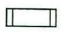
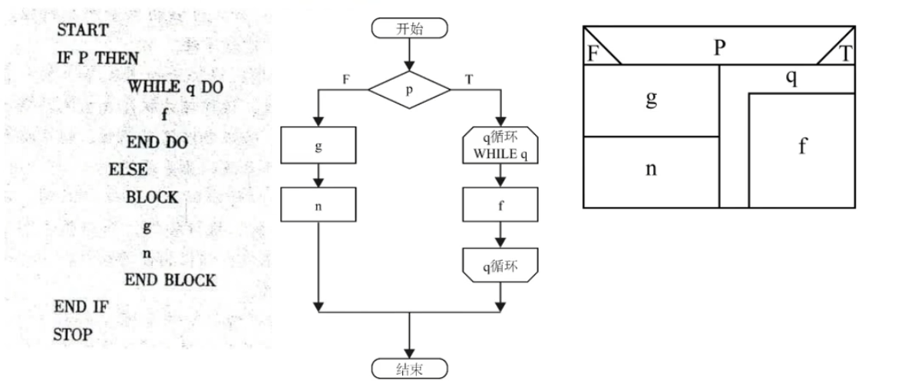
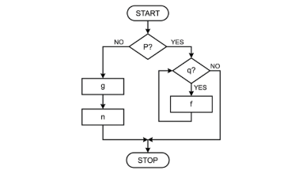
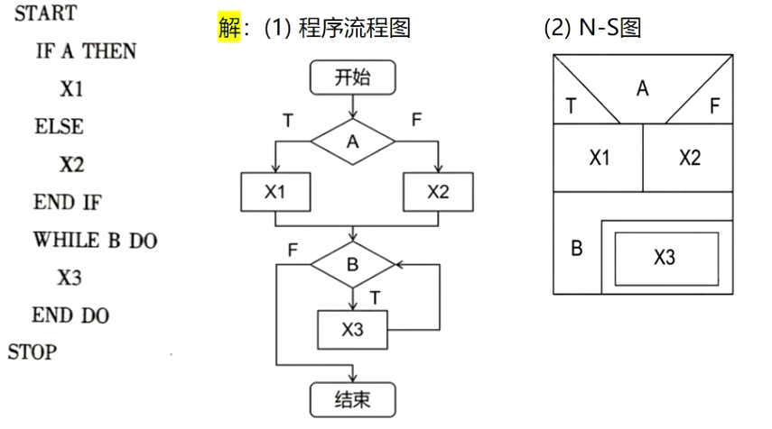
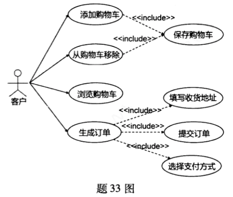
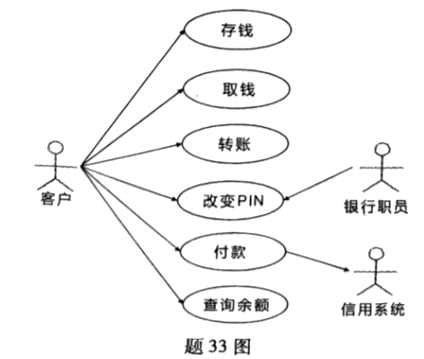
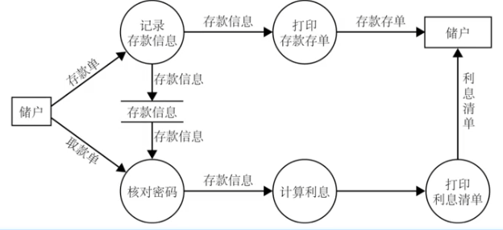

# 软件工程重点知识点例题汇总（去重版）

> 说明：仅保留 `重点复习清单.md` 中出现的知识点。
>
> 来源标记：`2504` 表示 `2025年4月考期真题汇总.md`，`2510` 表示 `202510真题.md`，`笔果来源` 表示 `简答题.md`。
>
> 去重规则：同一道题只保留一次；若同题在多个题库重复出现，则合并为一个题目并同时标注多个来源。

---

## 🔴 必背内容（出现概率 > 80%）

### 1. 瀑布模型的 5 个阶段及其任务

**核心知识点**

| 阶段 | 任务 |
|------|------|
| **需求定义** | 弄清用户需求，输出《用户规格说明书》 |
| **系统和软件设计** | 建立总体结构，画出软件体系结构图 |
| **实现与单元测试** | 用编程语言实现软件，并对其进行测试 |
| **集成与系统测试** | 将软件所有模块集中到一起进行测试，输出测试报告、测试用例、测试结果 |
| **运行与维护** | 软件投入使用，根据用户要求进行维护 |

**瀑布模型缺点**：
- 项目执行难遵循顺序化流程，灵活性差
- 客户难以清晰、完整描述全部需求
- 客户需长期等待，仅在项目尾声才能获得可执行程序
- 重大错误在评审可运行程序前难以及时发现

### 例题

**1. 以下哪项是瀑布模型的缺点【2504】**

- A. 客户难以在早期看到可运行的程序 ✅
- B. 软件过程具有可控性和系统性
- C. 将软件过程划分为不同的阶段
- D. 需求变更容易实现

---

**2. 简述瀑布模型每个阶段的任务【2504】**

1. **需求定义**：弄清用户对软件的全部需求。
2. **系统和软件设计**：建立软件总体结构，画出软件体系结构图。
3. **实现与单元测试**：用编程语言实现软件，并对其进行测试。
4. **集成与系统测试**：将软件所有模块集中到一起进行测试。
5. **运行与维护**：软件投入使用，根据用户需求进一步优化软件。

---

**3. 瀑布模型缺点【笔果来源】**

1. 项目执行难遵循**顺序化**流程，灵活性差。
2. 客户难以清晰、完整描述全部**需求**。
3. 客户需长期**等待**，仅在项目尾声才能获得可执行程序。
4. 重大错误在评审可运行程序前难以及时发现。

---

**4. 瀑布模型【2510】**

是一种线性软件开发模型，将软件开发过程划分为：

1. **需求定义**
2. **系统和软件设计**
3. **实现与单元测试**
4. **集成与系统测试**
5. **运行与维护**

---

**5. 软件开发的过程需要严格按照先进行需求分析，再进行系统设计，根据设计方案进行编码的软件过程模型是【课后习题】**

- 1. 瀑布模型 ✅
- 2. 原型模型
- 3. 螺旋模型
- 4. 统一过程模型

---

### 2. 耦合性的 7 种类型

**核心知识点**

**耦合性**：衡量模块间依赖程度的标准，接口复杂，调用方式紧密，传递数据多，耦合性就强。

| 耦合类型 | 概念 | 耦合度 |
|----------|------|--------|
| **非直接耦合** | 模块之间互不直接打交道，都听主模块的指挥，耦合程度最低 两个模块之间没有直接关系，它们之间的联系完全通过主模块的控制和调用来实现 | 最低 ✅ |
| **数据耦合** | 模块之间只传简单的数据值，比如传一个数字或字符串 一个模块访问另一个模块时，彼此之间通过简单的数据参数来交换信息 | 低 ✅ |
| **标记耦合** | 模块之间传递的是数据结构的一部分，比如只传用户对象中的姓名和年龄 一组模块通过参数表传递记录信息，共享某一数据结构的子结构 | 中 |
| **控制耦合** | 一个模块指挥另一个模块怎么做，比如传一个flag让对方判断执行哪段代码 一个模块通过开关、标志、名字等控制信息，明显地控制另一个模块的内部逻辑 | 中 |
| **外部耦合** | 多个模块都去读同一个全局变量，比如都去读系统当前时间 一组模块都访问同一全局简单变量，而不是同一全局数据结构，且不是通过参数表传递 | 较高 |
| **公共耦合** | 多个模块共用一块公共数据区，像大家一起写同一块黑板，一个人改了别人都能看到 一组模块都访问同一个公共数据环境，如全局数据结构、共享通信区、内存公共覆盖区 | 高 ❌ |
| **内容耦合** | 一个模块直接闯进另一个模块内部搞事情，比如直接修改对方的私有变量，最糟糕的耦合 一个模块直接访问另一个模块的内部数据，或不通过正常入口进入另一个模块内部，耦合程度最高 | 最高 ❌ |

**记忆口诀**：非数标控外公内（藕树标控外公内）

### 例题

**1. 在结构化设计中，其模块的耦合性越低，模块的独立性【2504】**

- A. 越低
- B. 越高 ✅
- C. 不变
- D. 无法确定

---

**2. 简述模块的耦合性并列举三种耦合类型【2504】**

**定义**：衡量模块间依赖程度的标准，接口复杂，调用方式紧密，传递数据多，耦合性就强。

**耦合类型示例**：

- 非直接耦合
- 数据耦合
- 标记耦合
- 控制耦合
- 外部耦合
- 公共耦合

---

**3. 如果一个模块访问另一个模块时，彼此之间是通过数据参数来交换输入输出信息的，则称这种耦合为____耦合【2510】**

**答案**：数据

---

**4. 什么是模块的独立性【笔果来源】**

软件系统中每个模块仅实现特定子功能，且与其他模块的接口简单。

---

### 3. 内聚性的 8 种类型

**核心知识点**

**内聚性**：模块内部各元素抱团的紧密程度，高内聚就是大家一心一意做同一件事。

| 内聚类型 | 概念 | 内聚度 |
|----------|------|--------|
| **巧合内聚** | 模块内部各元素毫无关联，像把几段不相关的代码硬凑在一起 也称偶然内聚，模块内各部分没有联系或联系很松散，内聚程度最低 | 最低 ❌ |
| **逻辑内聚** | 一个模块做几件事，靠参数决定做哪件，比如一个模块既处理加法又处理减法 把几种功能相似或相关的操作组合在一个模块里，通过传入参数来控制执行哪种功能 | 低 |
| **时间内聚** | 多个功能因为时间关系聚在一起，比如系统启动时要同时初始化多个配置 又称经典内聚，模块内的多个功能必须在同一时间段内执行，通常用于初始化或定时任务 | 中 |
| **过程内聚** | 模块内的操作必须按固定顺序执行，像A做完才能做B，B做完才能做C 模块内的处理元素相关，且必须以特定次序执行 | 中 |
| **通信内聚** | 模块内的功能操作同一个数据源，比如都读取同一张用户表 模块内各功能部分都使用相同的输入数据，或产生相同的输出数据 | 较高 |
| **顺序内聚** | 像流水线一样，上一步的输出是下一步的输入 模块内各处理元素密切相关，前一个功能的输出作为下一个功能的输入 | 较高 |
| **信息内聚** | 多个功能共用一套数据结构，但各自有独立的入口，比如对数据库的增删改查 一个模块完成多个功能，每个功能都操作同一个数据结构，每个功能有唯一的入口点 | 高 |
| **功能内聚** | 模块只做一件事，且把这件事做到极致，比如专门计算圆面积的模块 模块中每个部分都是完成某一具体功能必不可少的组成部分，内聚程度最高 | 最高 ✅ |

**记忆口诀**：巧逻时过通，顺信功（巧罗是过错，顺信功）

### 例题

**1. 如果一个模块内的处理过程是相关的，而且必须以特定次序执行，则称这个模块为____内聚模块【2504】**

**答案**：过程

---

**2. 巧合内聚【2510】**

也称偶然内聚，模块内各部分没有联系或联系很松散，内聚程度最低。

---

### 4. 软件测试的 4 个步骤

**核心知识点**

| 步骤 | 别名 | 说明 |
|------|------|------|
| **单元测试** | 模块测试 | 对单个程序模块进行测试 |
| **组装测试** | 集成测试 | 将模块组装在一起进行测试 |
| **确认测试** | 验收测试 | 验证软件是否符合用户需求 |
| **系统测试** | - | 将软件与硬件、外设等结合，在实际运行环境下测试 |

### 例题

**1. 简述软件测试基本步骤【2510 / 笔果来源】**

单元测试、组装测试、确认测试、系统测试。

---

**2. 以下哪种测试是在软件开发的最早阶段进行的【2504】**

- A. 系统测试
- B. 单元测试 ✅
- C. 组装测试
- D. 确认测试

---

**3. 把单元测试过的所有模块组装在一起进行测试的方式称作____组装测试【2504】**

**答案**：一次性

---

**4. 软件测试的主要目的是【2510】**

- 1. 证明程序无错
- 2. 发现程序中的错误 ✅
- 3. 修复程序中的错误
- 4. 简化程序的功能

---

### 5. 软件维护的 4 种类型

**核心知识点**

| 维护类型 | 概念 | 触发原因 |
|----------|------|----------|
| **改正性维护** | 识别并纠正错误、优化性能 | 发现了测试阶段未察觉的错误 |
| **适应性维护** | 适配外部环境变化 | 软件运行环境发生变化 |
| **完善性维护** | 满足用户新功能/性能需求 | 用户提出新的功能需求 |
| **预防性维护** | 提升软件可维护性、可靠性 | 预防未来可能出现的问题 |

**记忆口诀**：纠适配完预（就适配完预）

### 例题

**1. 什么是软件维护？软件维护有哪几种类型【2504】**

**定义**：软件交付使用后，为改正错误或满足新的需求而修改软件的过程。

**四种类型**：

1. **改正性维护**：识别并纠正错误、优化性能
2. **适应性维护**：适配外部环境变化
3. **完善性维护**：满足用户新功能/性能需求
4. **预防性维护**：提升软件可维护性、可靠性

---

**2. 修改或再开发软件，以扩充软件功能、增强软件性能、提高软件的可维护性，这种情况下进行的维护活动是什么【2510】**

- 1. 改正性维护
- 2. 适应性维护
- 3. 完善性维护 ✅
- 4. 预防性维护

---

**3. 引起软件维护的原因有哪些【笔果来源】**

1. 发现**测试阶段未检出的隐藏错误**。
2. 软件**运行环境发生变化**。
3. 用户提出**新的功能需求**。

---

**4. 任何软件交付使用后都可能需要进行软件维护，下列关于引起软件维护的原因中，错误的是【课后习题】**

- 1. 软件投入运行时间过长 ✅
- 2. 软件交付使用后发现了新的错误
- 3. 软件使用一定时间后，用户提出了新的需求
- 4. 软件的运行环境发生变化，需要进行软件的迁移

---

### 6. 封装、继承、多态的概念

**核心知识点**

#### 封装
- **定义**：将对象的属性与服务结合成一个独立的系统单元，是一种信息隐藏技术
- **作用**：将对象的外部特征与内部实现细节分开，外部可访问特征，内部细节被隐藏

#### 继承
- **定义**：子类从父类派生，自动拥有父类全部数据和服务的面向对象特性
- **关系**：子类（派生类）继承父类（基类）的属性和方法

#### 多态性
- **定义**：子类对象可以像父类对象那样使用同样的消息，但不同层次中的类按自己的需求来实现方法（子类可以当父类使用，一种方法多种实现）
- **C++实现**：通过虚函数实现
- **补充**：在 C++ 中，对象的操作称作成员函数

### 例题

**1. 封装【2504】**

封装是将对象的属性与服务绑定为独立单元的信息隐藏技术，外部可访问其特征，内部细节则完全隐蔽。

---

**2. 简述封装及其在面向对象方法中的作用【2510】**

封装是面向对象方法的一个重要原则，它将对象的属性和服务结合成一个独立的系统单元，是一种信息隐藏技术。封装的作用是将对象的外部特征与内部实现细节分开，使得对象的外部特征对其他对象是可访问的，而内部细节对其他对象是隐蔽的。

---

**3. 继承【2510】**

子类从父类派生，自动拥有父类全部数据和服务的面向对象特性。

---

**4. 继承是指一个类的定义中可以派生出另一个类的定义，派生出的类被称作____【2504】**

**答案**：子类

---

**5. 在 C++ 语言中，多态性是通过____来实现的【2504】**

**答案**：虚函数

---

**6. 多态性是指子类对象可以像____对象那样使用同样的消息，但不同层次中的类按自己的需求来实现方法【2510】**

**答案**：父类

---

**7. 在 C++ 中，对象的____称作成员函数【2504】**

**答案**：操作

---

### 7. 程序流程图和 N-S 图的绘制

**核心知识点**

#### 程序流程图符号
| 符号 | 含义 |
|------|------|
| 椭圆 | 开始/结束 |
| 矩形 | 处理/操作 |
| 菱形 | 判断/条件 |
| 箭头 | 流程方向 |
| 平行四边形 | 输入/输出 |

#### N-S图特点
- 取消了流程线，完全用矩形框表示
- 清晰表达嵌套结构
- 三种基本结构：顺序、选择、循环

### 例题

**1. 在程序流程图中，用于表示预定义处理的图表是【2504】**

-  
-  
-  
- ✅

---

**2. 下列图表中，可用于详细设计的是【2504】**

- A. SC
- B. N-S 图 ✅
- C. 数据流图
- D. 判定树

---

**3. 画出下列伪代码程序的程序流程图和盒图【2504】**

**题目图片**：

**答案**：直接采用题库提供的对应图示。

---

**4. 请画出下列伪代码对应的程序流程图和 N-S 图【2510】**

**题目图片**：

**答案**：直接采用题库提供的对应图示。

---

## 🟡 高频考点（出现概率 60%-80%）

### 1. UML 图的类型及作用

**核心知识点**

| UML图 | 作用 | 核心元素 |
|-------|------|----------|
| **类图** | 描述系统的静态结构 | 类名、属性、操作、关联、泛化、聚合、组合 |
| **用例图** | 描述系统功能 | 用例（椭圆）、角色（小人）、关联、包含、扩展 |
| **时序图** | 描述对象间的交互（时间顺序） | 对象、生命线（虚线）、消息、活动棒 |
| **状态图** | 描述对象的状态变化 | 状态（圆角矩形）、迁移（箭头）、事件触发器 |
| **部署图** | 显示网络的物理布局和组件位置 | 节点、构件 |
| **组件图** | 显示模型的物理视图 | 组件、接口、依赖关系 |

**类图三部分**：类名、属性、操作

**类间关系**：
- **关联**：结构性关系
- **泛化**：一般与特殊（父子）关系
- **聚合**：整体与部分，部分可独立存在（空心菱形）
- **组合**：整体与部分，部分不能独立存在（实心菱形）
- **依赖**：使用关系（弱相关）

### 例题

**1. 面向对象分析常用的 5 种 UML 图是什么【笔果来源】**

部署图、用例图、时序图、类图、状态图。

---

**2. UML 的定义和用途分别是什么【笔果来源】**

1. **定义**：通用的**可视化建模语言**。
2. **用途**：描述、可视化处理、构造和建立软件系统文档；覆盖系统**需求分析、设计、浏览、配置、维护、信息控制**全流程。

---

**3. 类图中每个类用方框表示，分成三部分，分别是【2504】**

- A. 类名、属性和操作
- B. 类名、对象和操作 ✅
- C. 类名、属性和对象
- D. 对象、属性和操作

---

**4. 下列哪项不属于时序图的元素【2504】**

- A. 对象
- B. 生命线
- C. 对象的属性 ✅
- D. 消息

---

**5. 在时序图中，对象之间传递的消息类型不包括【2510】**

- 1. 复杂消息 ✅
- 2. 同步消息
- 3. 异步消息
- 4. 返回消息

---

**6. UML 中的____图是显示网络的物理布局和各种组件的位置【2504】**

**答案**：部署

---

**7. 下列关于用例图的叙述中，正确的是【课后习题】**

- 1. 用例图用于描述系统的业务
- 2. 用例图用于表示系统中类的构成
- 3. 用例图用于描述系统的功能 ✅
- 4. 用例图用于表示系统的状态变化

---

**8. 在一个状态机或状态机图中，下列说法正确的是【2504】**

- 1. 只能有一个起始状态 ✅
- 2. 可以有多个起始状态
- 3. 只能有一个结束状态
- 4. 不需要结束状态

---

**9. 简述类图中组合关系的含义【2504】**

组合关系是类之间**整体与部分**的强依赖关联关系：
- 部分类的实例完全隶属于整体类的实例
- 二者**共存亡**
- 当整体类的实例被销毁时，其包含的部分类实例也会随之消失，失去存在意义

---

**10. 简述面向对象设计准则【2504】**

1. 模块化
2. 抽象
3. 信息隐蔽
4. 低耦合
5. 高内聚
6. 可复用

---

**11. 客户的网上购物用例图分析【2504】**

**题目描述**：根据网上购物用例图完成下列任务：

**题目图片**：

**问题**：

1. **图中有几个用例**
2. **请给出网上购物系统的需求描述**
3. **包含关系发生在哪些用例之间**

**参考答案**：

1. 8 个用例
2. 需求描述：
   - 允许用户添加商品到购物车
   - 允许客户从购物车中移除商品
   - 当添加/移除商品时要保存购物车
   - 允许客户浏览购物车
   - 允许客户生成订单
   - 生成订单需要填写收货地址、提交订单、选择支付方式
3. 包含关系：
   - 添加购物车与保存购物车
   - 从购物车中移除与保存购物车
   - 生成订单与填写收货地址
   - 生成订单与提交订单
   - 生成订单与选择支付方式

---

**12. ATM 系统的需求说明如下：客户可以取钱、存钱、付款、查阅余额和改变 PIN；银行职员也可以改变 PIN；客户付款到信用系统。请根据 ATM 系统的用例图完成下列任务【2510】**

**题目图片**：

**问题**：

1. **给出该 ATM 系统的角色和用例**
2. **信用系统是否为角色并说明原因**

**参考答案**：

1. **角色**：客户、银行职员、信用系统
2. **用例**：取钱、存钱、转账、改变 PIN、付款、查询余额
3. 信用系统是角色，因为它是外部系统

---

### 2. 数据流图的符号含义

**核心知识点**

| 符号 | 含义 | 图形 |
|------|------|------|
| ○ | 加工/处理 | 圆 |
| → | 数据流向 | 箭头 |
| □ | 数据的源点与终点 | 方框 |
| = 或 — | 数据文件/数据存储 | 双横线或单横线 |

**画分层数据流图的原则**：
1. 父图子图输入输出平衡
2. 区分局部文件与外部项
3. 控制分解速度
4. 遵守加工编号规则

### 例题

**1. 数据流图中，圆圈 O 代表加工，箭头 → 代表____【2504】**

**答案**：数据流向

---

**2. 需求规格说明书包括哪些内容？有哪些图、表可用于描述需求【2504】**

**内容包括**：引言、数据描述、功能描述、性能描述、质量保证。

**可用图表**：数据流图、数据结构图、数据字典、判定树、判定表。

---

**3. 需求规格说明书中，用于对数据进行描述的工具是【课后习题】**

- 1. 数据流图
- 2. 数据结构图
- 3. 数据字典 ✅
- 4. 数据加工图

---

**4. 在结构化分析中，分层数据流图的主要优点是【2510】**

- 1. 可以一次性展示系统的全部细节
- 2. 能够清晰地表示程序的全部控制结构
- 3. 便于实现和便于使用，能够有效控制问题的复杂性 ✅
- 4. 可以直接用于代码设计

---

**5. 画分层数据流图有哪些原则【笔果来源】**

1. 父图子图**输入输出平衡**
2. 区分**局部文件与外部项**
3. 控制**分解速度**
4. 遵守**加工编号规则**

---

**6. 数据流图由哪些符号组成【笔果来源】**

1. ○：加工
2. →：数据流向
3. □：数据的源点与终点
4. = / —：数据文件（数据存储）

---

**7. 数据流图【2510】**

表达目标系统逻辑模型的工具，包含加工、数据流向、数据的源点与终点，数据文件或其它数据存储。

---

**8. 银行计算机储蓄系统数据流图【2504 / 笔果来源】**

**题目描述**：储户填写的存款单或取款单由业务员输入系统，如果是存款，则系统记录存款人姓名、住址、身份证号码、存款类型、存款日期、到期日期、利率及密码等信息，并打印出存款存单给储户；如果是取款且存款时留有密码，则系统首先核对储户密码，若密码正确或存款时未留密码，则系统计算利息并打印出利息清单给储户。

**要求**：用数据流图描绘本系统的功能。

**参考答案图片**：

**答案**：直接采用题库提供的对应图示。

---

### 3. 需求分析与详细设计表达

**核心知识点**

- 需求分析阶段的主要任务：确定软件的功能和性能需求。
- 信息隐藏的主要目的：隐藏模块的实现细节。
- 详细设计阶段常用表达工具包括程序流程图、N-S 图、PAD 图，`HIPO图` 不属于此类常用表达工具。

### 例题

**1. 在结构化软件开发方法中，需求分析阶段的主要任务是【2510】**

- 1. 编写代码
- 2. 设计软件的体系结构
- 3. 确定软件的功能和性能需求 ✅
- 4. 进行软件测试

---

**2. 在软件设计中，信息隐藏的主要目的是【2504】**

- A. 提高模块的耦合度
- B. 降低模块的内聚性
- C. 隐藏模块的实现细节 ✅
- D. 提高系统的运行效率

---

**3. 详细设计阶段，常用的表达工具不包括【2510】**

- 1. 程序流程图
- 2. N-S图
- 3. PAD图
- 4. HIPO图 ✅

---

**4. 软件需求分析的任务是什么？需求分析的步骤是什么【课后习题】**

**任务**：完全弄清用户对软件系统的确切要求，并用需求规格说明书的形式表达出来。

**步骤**：
1. 对现实环境进行调查研究，获得系统的具体模型。
2. 去掉具体模型中的非本质因素，抽象出当前系统的逻辑模型。
3. 分析当前系统与目标系统的差别，建立目标系统的逻辑模型。
4. 对目标系统进行完善与补充，写出完整的需求说明。
5. 对需求说明进行评审，直到确认文档齐全，符合用户需求。

---

### 4. 单元测试的驱动模块和桩模块

**核心知识点**

| 模块类型 | 作用 | 说明 |
|----------|------|------|
| **驱动模块** | 代替被测模块的调用模块 | 接收测试数据并传给被测模块，输出测试结果 |
| **桩模块** | 代替被测模块所调用的模块 | 仅做少量数据操作，无需实现被调用模块的全部功能 |

**单元测试5方面**：
1. 模块接口
2. 局部数据结构
3. 路径
4. 错误处理
5. 边界

### 例题

**1. 简述组装测试的相关概念：（1）组装方式有哪些；（2）自顶向下组装测试的步骤；（3）驱动模块和桩模块的作用【笔果来源】**

**（1）组装方式**：

1. **一次性组装测试**
2. **增殖式组装测试**：自顶向下、自底向上、混合组装测试

**（2）自顶向下组装测试步骤**：

1. 主模块作驱动，下属模块用桩，测试主模块。
2. 按深度优先或分层策略，用实际模块替代桩模块，组装新子系统。
3. 回归测试，排查组装引入的新错误。
4. 检查是否所有模块组装完成。

**（3）驱动模块和桩模块作用**：

- **驱动模块**：作为被测模块的调用者，接收测试数据并传给被测模块，最终输出测试结果。
- **桩模块**：代替被测模块调用的模块，仅做少量数据操作，无需实现被调用模块的全部功能。

---

**2. 简述单元测试的主要内容【2504】**

对程序中单个模块进行测试，又称模块测试，模块分为：

- **驱动模块**：代表被测程序的调用程序
- **桩模块**：被测程序需要调用的程序

需要分别从以下 5 部分进行检查：

1. 模块接口
2. 局部数据结构
3. 路径
4. 错误处理
5. 边界

---

**3. 单元测试中，驱动模块的作用是接收____并将其传送给被测模块【2510】**

**答案**：测试数据

---

**4. 关于驱动模块的叙述，下列选项中正确的是【课后习题】**

- 1. 驱动模块可用于代替被测模块的子模块
- 2. 驱动模块用于代替被测模块的调用模块 ✅
- 3. 仅在测试阶段需要编写驱动模块
- 4. 仅在组装测试阶段需要编写驱动模块

---

**5. 组装测试的方式有哪几种【课后习题】**

一次性组装方式与增殖式组装方式，增殖式组装方式分为自顶向下的组装方式、自底向上的组装方式、混合组装方式。

---

### 5. 三层架构的组成

**核心知识点**

| 层次 | 名称 | 功能 |
|------|------|------|
| 第一层 | **界面层/表示层** | 负责用户界面展示（如JSP） |
| 第二层 | **业务逻辑层** | 负责业务处理（如Servlet、JavaBean） |
| 第三层 | **数据访问层** | 负责数据存储和访问（如DAO） |

**MVC模式**：
- **M（Model）模型**：承载应用内容与处理逻辑
- **V（View）视图**：负责界面功能实现
- **C（Controller）控制器**：协调模型与视图的访问

### 例题

**1. 通常意义上的三层架构就是将整个业务应用划分为界面层、业务逻辑层和____【2504】**

**答案**：数据访问层

---

**2. 最典型的 MVC 模式应用是 JSP+Servlet+JavaBean+DAO 模式，其中为表现层的是【2510】**

- 1. JSP ✅
- 2. Servlet
- 3. JavaBean
- 4. DAO

---

**3. 下列关于 MVC 模式的叙述中，正确的是【课后习题】**

- 1. MVC 用视图、数据、操作三个部分组织程序
- 2. MVC 模型将系统分为界面层、业务逻辑层和数据访问层
- 3. MVC 将应用程序划分为视图、控制器、模型三个核心部件 ✅
- 4. MVC 应用程序被分成用户界面、计算程序、输出程序三个核心部分

---

### 6. 移动应用开发的 5 个阶段

**核心知识点**

| 阶段 | 主要工作 |
|------|----------|
| **需求分析** | 明确产品目标、功能与原型范围 |
| **设计** | 架构、导航、界面、内容设计 |
| **开发** | 编码实现功能与非功能需求 |
| **稳定** | 可行性、alpha、beta原型到候选发布版 |
| **部署** | 应用商店审查上架 |

**移动App特点**：
1. 强调用户体验
2. 需求及环境的复杂性
3. 技术难度更高

**移动App测试准则**：
- 性能测试、GUI测试、兼容性测试必须使用真实设备

### 例题

**1. 移动应用开发的 5 个迭代阶段包括【2504 / 笔果来源】**

1. **需求分析**
2. **设计**
3. **开发**
4. **稳定**
5. **部署**

---

**2. 移动应用具有哪些特点【笔果来源】**

1. 强调用户体验
2. 需求及环境的复杂性
3. 技术难度更高

---

**3. 移动 App 测试应遵循的准则有哪些【笔果来源】**

1. 定位性能瓶颈前，先明确网络与设备环境。
2. 在不受控的真实条件下开展测试。
3. 选用适配的自动化测试工具。
4. 借助加载设备平台矩阵法，确定核心硬件平台测试组合。
5. 对所有可能平台，至少做一次端到端功能流校验。
6. 性能、GUI、兼容性测试必须使用真实设备。
7. 性能指标测量仅限无线通信和真实用户负载条件。

---

**4. 移动应用测试中，性能测试的主要目的是【2510】**

- 1. 发现应用的安全漏洞
- 2. 测试在集成系统环境中软件运行时的性能 ✅
- 3. 确保应用的用户界面美观
- 4. 确保应用的导航功能正常

---

**5. 移动应用开发中，用户体验测试包括____测试、虚拟键盘输入、语音输入和识别以及警报和异常条件【2510】**

**答案**：手势

---

**6. 下列哪个不是移动应用开发框架【2504】**

- A. 苹果
- B. 安卓
- C. Windows
- D. C 语言 ✅

---

**7. 下列选项中，移动应用不同于传统应用程序的特点是【课后习题】**

- 1. 应用与网络相关
- 2. 需要友好的用户界面
- 3. 需要采用工程化方法进行应用开发
- 4. 移动应用需要支持更多样化的人机交互方式 ✅

---

**8. 关于开发移动应用技术的叙述中，正确的是【课后习题】**

- 1. 由于移动设备资源有限，因此开发移动应用适合采用机器级语言
- 2. 由于移动设备硬件的多样性，因此应该在移动硬盘上直接开发移动应用
- 3. 针对不同平台的移动应用需要在不同的环境下分开开发 ✅
- 4. 移动应用的规模较小，因此其开发适合采用瀑布模型

---

### 7. 白盒测试 vs 黑盒测试

**核心知识点**

| 对比项 | 白盒测试 | 黑盒测试 |
|--------|----------|----------|
| **别称** | 结构测试/逻辑驱动测试 | 功能测试/数据驱动测试 |
| **关注点** | 程序内部逻辑结构 | 程序外部功能 |
| **是否需要看代码** | 是 | 否 |
| **设计依据** | 代码逻辑 | 需求规格说明 |
| **测试内容** | 语句、路径、条件 | 功能、输入输出 |
| **优点** | 可早期发现问题，帮助优化代码 | 从用户角度出发，易于理解 |

**白盒测试逻辑覆盖类型**（由弱到强）：
1. 语句覆盖
2. 判定覆盖
3. 条件覆盖
4. 判定-条件覆盖
5. 条件组合覆盖
6. 路径覆盖

**黑盒测试方法**：等价类划分、边界值分析

### 例题

**1. 在软件测试中，以下哪种测试方法不需要执行被测程序【2504】**

- A. 黑盒测试
- B. 白盒测试
- C. 动态测试
- D. 静态测试 ✅

---

**2. 白盒测试【2504】**

聚焦代码级，需要了解程序内部构造，根据逻辑设计测试用例，检查语句、路径、条件，验证代码是否符合需求规范，优点是在早期可发现问题，帮助优化代码。

---

**3. 黑盒测试【2510】**

将程序视为黑盒，不关注内部结构，基于外部功能设计测试用例，验证功能是否正确，又称功能测试，优点是从用户角度出发易于理解。

---

**4. 简述白盒测试的优点【2510 / 笔果来源】**

可以在开发早期发现许多问题，基于程序内部逻辑结构，在代码级设计测试用例，检查语句、路径、条件等，验证是否符合需求与规范；可以帮助开发人员优化代码，提高软件性能和可维护性。

---

**5. 关于测试用例的设计，下列叙述正确的是【课后习题】**

- 1. 测试用例中的输入数据必须是合法数据
- 2. 测试用例必须由程序员通过分析程序结构生成
- 3. 测试用例中应该包含程序运行的预期结果 ✅
- 4. 测试用例应该覆盖所有的输入/输出结果

---

**6. 对求整数绝对值的函数进行黑盒测试所设计的测试用例中，应将输入数据划分为等价类的个数为【课后习题】**

- 1. 1
- 2. 2
- 3. 3 ✅
- 4. 4

---

## 🟢 一般考点（出现概率 40%-60%）

### 1. 软件危机的 6 个问题

**核心知识点**

1. 软件开发**无计划性**
2. 软件**需求不充分**
3. 开发过程**无规范**
4. 成本与进度**难控制**
5. 产品质量**无评测标准与方法**
6. 交付后的软件**难以维护**

**软件工程定义**：从管理和技术两方面研究如何更好地开发和维护计算机软件的一门学科，按工程化原则和方法组织软件开发。

### 例题

**1. 简述软件危机所描述的软件开发遇到的主要问题【2510】**

1. 软件开发无计划性
2. 软件需求不充分
3. 开发过程无规范
4. 成本与进度难控制
5. 产品质量无评测标准与方法
6. 交付后的软件难以维护

---

**2. 关于引起软件危机的原因，下列选项中，错误的是【课后习题】**

- 1. 软件难以维护
- 2. 软件的开发成本难以控制
- 3. 软件的实现缺乏好的算法 ✅
- 4. 没有测评软件产品质量的标准

---

**3. 软件工程【2504】**

从管理与技术方面研究如何更好开发与维护计算机软件的一门学科，思想是按照工程化原则和方法组织软件开发。

---

### 2. 软件的定义、软件过程与软件工程的研究领域

**核心知识点**

**软件**：程序、数据及其相关文档。

**软件过程 4 种基本活动**：软件需求分析、软件设计和实现、软件测试、软件演进。

1. 软件开发过程的**步骤规划**
2. 软件需求的**获取与规范描述**
3. 软件设计的**方案制定与表达**
4. 高质量、易维护的**程序实现方法**
5. 保障功能正确、减少隐藏错误的**软件测试策略**
6. 确保项目顺利推进的**软件项目管理方法**

### 例题

**1. 软件工程的研究领域包括哪些方面【笔果来源】**

1. 软件开发过程的**步骤规划**
2. 软件需求的**获取与规范描述**
3. 软件设计的**方案制定与表达**
4. 高质量、易维护的**程序实现方法**
5. 保障功能正确、减少隐藏错误的**软件测试策略**
6. 确保项目顺利推进的**软件项目管理方法**

---

**2. 关于软件的定义，以下哪项描述最准确【2510】**

- 1. 软件指用编程语言编写的程序
- 2. 软件只涉及用户界面设计
- 3. 软件是硬件的一部分
- 4. 软件包括程序、数据及其相关文档 ✅

---

**3. 一般而言，软件过程都需要包含以下 4 种基本活动【2504】**

软件需求分析、软件设计和实现、**软件测试**、软件演进。

---

### 3. 螺旋模型的特点

**核心知识点**

- 结合了**原型模型的迭代性质**和**瀑布模型的可控性与系统性**
- 全程**考虑风险**
- 第一圈产出**产品规格说明**
- 后续迭代开发原型并逐步完善

**统一过程模型5个阶段**：
1. 起始阶段
2. 细化阶段
3. 构建阶段
4. 转换阶段
5. 生产阶段

### 例题

**1. 螺旋模型进行软件开发的过程是什么【笔果来源】**

1. 螺旋模型划分为若干**框架活动**，每个活动对应螺旋的一个片段。
2. 开发从圆心启动，**顺时针**完成一圈螺旋对应一次演进活动，全程**考虑风险**，每次演进标记里程碑。
3. 第一圈产出**产品规格说明**，后续迭代开发原型并逐步完善，形成不同软件版本。
4. 每圈均需经过**策划区域**，据此调整项目计划、预算、进度以及软件开发的迭代次数。

---

**2. 统一过程模型 5 个阶段分别是什么【笔果来源】**

起始阶段、细化阶段、构建阶段、转换阶段、生产阶段。

---

**3. 螺旋模型应用在计算机软件的整个生命周期，把原型作为降低风险的机制，要求在项目的所有阶段始终考虑____风险【笔果来源】**

**答案**：技术

---

**4. 螺旋模型把软件开发为一系列演进版本，在早期的迭代中，软件可能是一个理论模型或是____【笔果来源】**

**答案**：原型

---

**5. 螺旋模型是一种演进式软件过程模型，它结合了原型模型的迭代性质和瀑布模型的____特点【笔果来源】**

**答案**：可控性和系统性

---

### 4. 敏捷开发的特点

**核心知识点**

- **快速**的软件开发和交付
- 强调客户在开发过程中的**紧密参与和需求反馈**
- 适合**需求萌动、快速改变的中小型软件产品**
- 适合**团队人员少、组织紧密的团队**
- **不适合**安全性、可靠性要求高的大型系统

### 例题

**1. 敏捷开发中，软件以____的方式进行开发，客户指定在每个增量中想要包含的需求【笔果来源】**

**答案**：增量

---

**2. 符合敏捷开发特点的是【2510】**

- 仅关注技术实现，不重视客户需求
- 强调客户在开发过程中的紧密参与和需求反馈 ✅
- 专注于中间产品的完善，而非最终交付
- 避免需求变更，以确保开发进度的稳定性

---

**3. 请举例三个适合敏捷开发模型的软件项目【课后习题】**

手机端的在线购物、医院挂号、信息查询 APP。

---

### 5. 极限编程的结对编程

**核心知识点**

- **主要目的**：提高代码质量和实时解决问题
- 使用面向对象方法作为开发范型
- **设计原则**：保持简洁（KIS）原则
- **设计工具**：CRC卡（类-职责-协作者）

### 例题

**1. 极限编程中，结对编程的主要目的是【2504】**

- 不需要开发人员
- 提高代码质量和实时解决问题 ✅
- 免除项目管理以及任务分配
- 不需要测试工作

---

### 6. 软件质量属性

**核心知识点**

**衡量软件可维护性的指标**：

- **可理解性**：读源码和文档后，理解程序功能与内部结构的难易程度。
- **可靠性**：程序在规定时间内按要求正确执行的概率。
- **可测试性**：程序是否容易验证其正确性。
- **可修改性**：程序是否容易修改。
- **可移植性**：程序是否容易转移到新的计算环境。
- **效率**：完成既定功能时对时间、存储等资源的利用是否合理。
- **可使用性**：程序是否方便、实用、易用。

### 例题

**1. 衡量软件可维护性的指标有哪些【笔果来源】**

可理解性、可靠性、可测试性、可修改性、可移植性、效率、可使用性。

---

**2. 可靠性【笔果来源】**

程序在规定时间内，按用户要求和设计目标正确运行的概率。

---

**3. 软件可使用性如何度量【笔果来源】**

1. 学习所需的体力和智力技能
2. 达到适度有效使用的时间
3. 有效使用时的生产率净增值
4. 用户主观评价

---

**4. 软件完整性如何度量【笔果来源】**

1. 定义两个子属性：**危险性**、**安全性**
2. 危险性：特定攻击在给定时间内发生的概率
3. 安全性：排除特定攻击的概率

---

**5. 软件可维护性如何度量【笔果来源】**

1. 可维护性采用**间接度量**方式
2. 核心指标是**平均修改时间（MTTC）**
3. MTTC 涵盖：分析变更需求、设计修改方案、实现并测试变更、推送变更至所有用户

---

**6. 什么是软件的可维护性？评价软件可维护性的指标有哪些【课后习题】**

纠正软件错误、缺陷、满足新需求时修改软件的容易程度。

评价指标：可理解性、可靠性、可测试性、可移植性、可修改性、效率、可使用性。

---

**整理说明**

- 已按 `重点复习清单.md` 去除非重点知识点。
- 已对重复题目进行合并去重。
- 若后续你还要，我可以继续把每个知识点下的题目再整理成“背诵版”或“只保留最典型 1-3 题版”。
